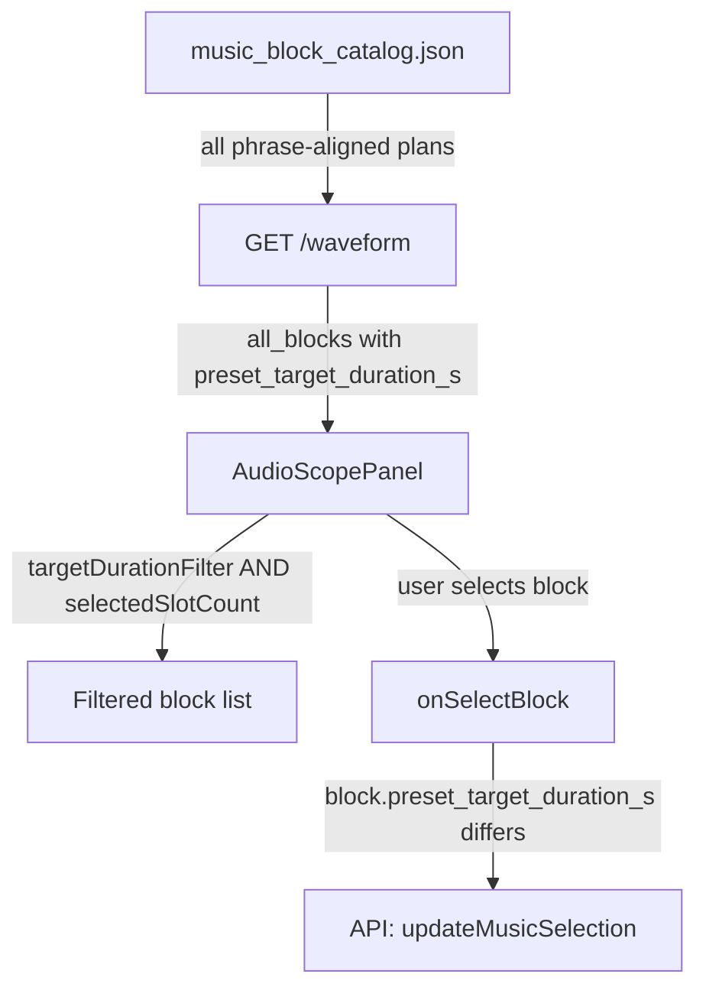

# Slot-driven "Any" filtering — TDD execution plan

## TDD protocol in force

Each component follows strict **Red → Green → Refactor** (Phase 2 → 3 → 4 of the skill):

- Phase 1 runs once at the start (baseline clean check).
- NEVER write implementation and test in the same turn.
- NEVER assume a test pass/fail — always run the terminal test runner and read stdout.
- Each refactor phase ends with an atomic commit.

## Architecture (unchanged from design)

```
[Target row]  Any | 5s | 10s | 15s | 20s | …
[Slots row]   Any | 1 | 2 | 3 | 4 | 5 | …
                    ↓ pure client-side AND filter
         filteredBlocks = all_blocks
           where preset_target_duration_s matches (or Any)
           AND   expected_slot_count       matches (or Any)
```



---

## Phase 1 — Baseline

Run and capture clean test output before any edit:

```bash
cd web && npm test -- --run
cd .. && python -m pytest tests/test_audio_scope_api.py tests/test_loop_planner.py -v
```

All must pass. If any fail, stop and triage first.

---

## Cycle A — `blockFilter.ts`

**Existing tests to map:** [`web/src/utils/slotCountFilter.test.ts`](web/src/utils/slotCountFilter.test.ts) — must stay green throughout.

### RED

New file `web/src/utils/blockFilter.test.ts`. Tests (one per case, each in its own `it`):

- `includes all blocks when both filters are Any`
- `filters by target duration only (slot Any)`
- `filters by slot count only (target Any)`
- `filters by both target duration and slot count (AND)`
- `returns empty when no block matches both filters`
- `returns all when all_blocks is empty and both Any`

Run: `npm test -- --run blockFilter` → must fail with "Cannot find module".

### GREEN

Create `web/src/utils/blockFilter.ts` — minimal implementation:

```ts
import type { MusicBlock } from "../types";

export function filterBlocks(
  blocks: MusicBlock[],
  targetDurationFilter: number | null,
  slotCountFilter: number | null,
): MusicBlock[] {
  return blocks.filter(
    (b) =>
      (targetDurationFilter === null ||
        b.preset_target_duration_s === targetDurationFilter) &&
      (slotCountFilter === null ||
        b.expected_slot_count === slotCountFilter),
  );
}
```

Run: `npm test -- --run blockFilter` → all 6 tests green.

### REFACTOR

JSDoc, single-responsibility check. Run: `npm test -- --run` (full suite). Atomic commit:
`feat(filter): filterBlocks dual AND filter with Any support`

---

## Cycle B — Python model fields

**Existing tests to map:** `tests/test_loop_planner.py`, `tests/test_audio_scope_api.py`.

### RED

New test in `tests/test_all_blocks.py`:

```python
def test_music_block_has_preset_target_duration_s_field():
    block = MusicBlock(...)
    assert hasattr(block, "preset_target_duration_s")
    assert block.preset_target_duration_s is None  # default

def test_waveform_payload_has_all_blocks_field():
    payload = WaveformPayload(...)
    assert hasattr(payload, "all_blocks")
    assert payload.all_blocks == []  # default empty list
```

Run: `pytest tests/test_all_blocks.py -v` → fail (fields do not exist).

### GREEN

Edit [`src/viral_editor/models.py`](src/viral_editor/models.py):

- `MusicBlock`: add `preset_target_duration_s: float | None = None`
- `WaveformPayload`: add `all_blocks: list[MusicBlock] = Field(default_factory=list)`

Run: `pytest tests/test_all_blocks.py -v` → green. Then: `pytest -v` (full suite) → no regressions.

### REFACTOR + commit

`feat(models): add preset_target_duration_s to MusicBlock and all_blocks to WaveformPayload`

---

## Cycle C — `get_waveform` populates `all_blocks`

**Existing tests to map:** `tests/test_audio_scope_api.py` — the existing `test_get_waveform_*` tests must stay green.

### RED

Add to `tests/test_all_blocks.py`:

```python
def test_get_waveform_all_blocks_includes_blocks_from_all_catalog_plans(client, job_with_catalog):
    resp = client.get(f"/api/jobs/{job_id}/audio/waveform")
    data = resp.json()
    assert "all_blocks" in data
    presets = {b["preset_target_duration_s"] for b in data["all_blocks"] if b["preset_target_duration_s"]}
    assert len(presets) > 1  # blocks from multiple duration presets

def test_get_waveform_all_blocks_blocks_have_expected_slot_count(client, job_with_catalog):
    resp = client.get(f"/api/jobs/{job_id}/audio/waveform")
    for block in resp.json()["all_blocks"]:
        assert block["expected_slot_count"] is not None
```

Run: `pytest tests/test_all_blocks.py -v` → fail (`all_blocks` is `[]`).

### GREEN

Edit [`src/viral_editor/api/routes/jobs.py`](src/viral_editor/api/routes/jobs.py) in `get_waveform`:

```python
from viral_editor.api.music import load_music_block_catalog
from viral_editor.audio.storyboard import _recommended_slot_count

catalog = load_music_block_catalog(temp_dir)
all_blocks: list = []
if catalog:
    for key, plan in catalog.plans.items():
        if plan.use_full_track or plan.target_match_failed:
            continue
        preset_s = float(key)
        for block in plan.blocks:
            slot_count = (
                block.expected_slot_count
                if block.expected_slot_count is not None
                else _recommended_slot_count(block.duration_s)
            )
            all_blocks.append(block.model_copy(update={
                "preset_target_duration_s": preset_s,
                "expected_slot_count": slot_count,
            }))
    all_blocks.sort(key=lambda b: (b.preset_target_duration_s or 0, -b.loop_quality))
```

Pass `all_blocks=all_blocks` into `build_waveform_payload` (or set on the returned payload directly).

Run: `pytest tests/test_all_blocks.py -v` → green. Then: `pytest -v` full suite → no regressions.

### REFACTOR + commit

Extract `_collect_all_blocks_from_catalog(catalog)` helper in `music.py`. Run full `pytest -v`.
`feat(waveform): expose all catalog blocks as all_blocks in WaveformPayload`

---

## Cycle D — Frontend types

No new test needed — TypeScript compilation IS the test. After adding fields to `types.ts`, `npm run build` (or tsc) must pass. This is part of Cycle A refactor or a standalone type-only step.

Edit [`web/src/types.ts`](web/src/types.ts):

```ts
export interface MusicBlock {
  // ... existing ...
  preset_target_duration_s?: number | null;
}

export interface WaveformPayload {
  // ... existing ...
  all_blocks?: MusicBlock[];
}
```

Run: `npm test -- --run` → no regressions. No separate commit needed — bundle with Cycle B commit or the next Cycle's commit.

---

## Cycle E — `AudioScopePanel` UI

**Existing tests:** `npm test -- --run` must be green as baseline.

### RED

Add to `web/src/components/AudioScopePanel.test.tsx` (create if not exists — minimal rendering test):

```ts
it("renders Any chip on Target Short Length row")
it("renders Any chip on Slots row")
it("clicking Any chip on Target row calls onTargetDurationFilterChange(null)")
it("clicking Any chip on Slots row calls onSlotCountChange(null)")
it("does not render Clear button")
```

Run: `npm test -- --run AudioScopePanel` → fail (component has no Any chips, has Clear).

### GREEN

Edit [`web/src/components/AudioScopePanel.tsx`](web/src/components/AudioScopePanel.tsx):

- Props: remove `onTargetChange` from chip handlers; add `targetDurationFilter`, `onTargetDurationFilterChange`
- Target row: prepend **Any** chip; preset clicks call `onTargetDurationFilterChange` (no API)
- Slots row: prepend **Any** chip; remove Clear button
- Block list source: `waveform.all_blocks?.length ? waveform.all_blocks : blocks`; apply `filterBlocks(pool, targetDurationFilter, selectedSlotCount)`
- Slot chip counts: derived from `filterBlocks(pool, targetDurationFilter, null)` grouped by `expected_slot_count`
- Scope canvas: still uses `blocks` (active target plan, unchanged)

Run: `npm test -- --run AudioScopePanel` → green. Then: `npm test -- --run` full suite.

### REFACTOR + commit

`feat(AudioScopePanel): Any chips on both rows, pure client-side dual filter`

---

## Cycle F — `App.tsx` state

### RED

Type-level test: in a new `web/src/App.test.tsx` (or existing integration test), assert:

```ts
it("initialises targetDurationFilter as null")
it("block selection triggers requestTargetChange when preset differs from form target")
```

Run: `npm test -- --run App` → fail.

### GREEN

Edit [`web/src/App.tsx`](web/src/App.tsx):

```ts
const [targetDurationFilter, setTargetDurationFilter] = useState<number | null>(null);
```

Update `handleSelectBlock`:

```ts
const handleSelectBlock = (block: MusicBlock) => {
  setSelectedBlockId(block.id);
  if (
    block.preset_target_duration_s != null &&
    block.preset_target_duration_s !== form.targetDurationS
  ) {
    requestTargetChange(block.preset_target_duration_s, false);
  }
};
```

Reset `targetDurationFilter` to `null` on new job load and after `handleAudioSelected`. Pass new props to `AudioScopePanel`.

Run: `npm test -- --run App` → green. Then full `npm test -- --run`.

### REFACTOR + commit

`feat(App): targetDurationFilter state; block selection drives storyboard target`

---

## Forbidden during execution

- No test file and implementation file written in the same tool-call turn
- No assumed pass/fail — must read raw terminal stdout after every test run
- No skipped refactor phases
- No stacked features in one commit
