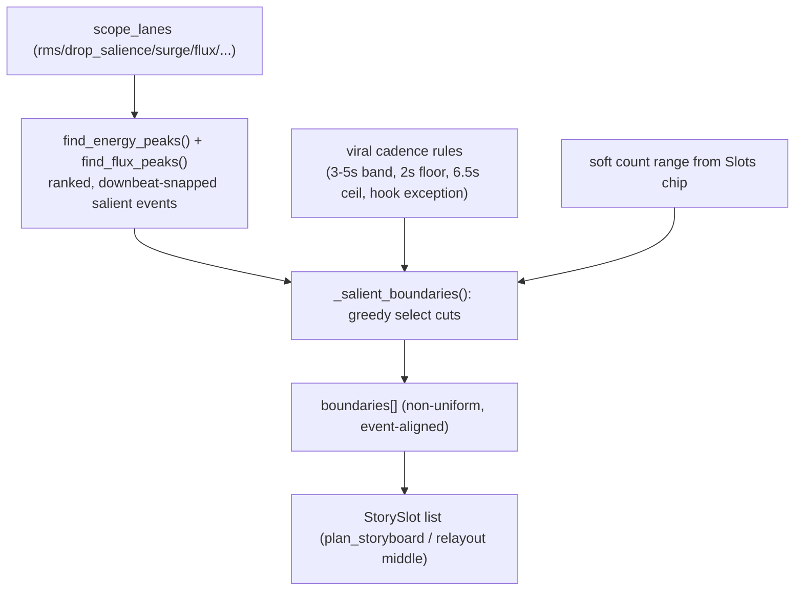

# Audio-driven clip slot planning

## Problem

Slot durations are audio-blind today. Two hardcoded heuristics drive everything:

- **Count:** `_recommended_slot_count(duration)` = `round(duration / 4.0)`, clamped `1..8` and floored by `duration / 1.5` — [src/viral_editor/audio/storyboard.py](src/viral_editor/audio/storyboard.py) L38-44.
- **Boundaries:** `_compute_boundaries` computes `ideal = duration / slot_count` and snaps each cut to the *nearest downbeat* — L253-270. This yields near-uniform slots; the last slot only differs because it absorbs the remainder to `window_end` (L271) and, with teaser on, becomes the fixed `hook_end` build segment.

The audio is already analyzed into rich per-frame lanes (`rms, band_low/mid/high, build, drop_salience, surge, flux_low, flux_high, pacing_density, vocal`) and ranked into impactful moments by `find_energy_peaks()` / `find_flux_peaks()` in [src/viral_editor/editing/retention_policy.py](src/viral_editor/editing/retention_policy.py) — but only FX placement consumes them, never slot layout.

## Design decisions (confirmed)

- **Slot count = audio-driven within a soft range.** Count emerges from the number of qualifying salient events, clamped to a band around the user's Slots chip so the UI stays predictable.
- **Durations governed by viral cadence.** Aim slots into the 3-5s pattern-interrupt band (reuse `INTERRUPT_MIN_GAP_S=3.0`, `INTERRUPT_MAX_GAP_S=5.0`), with a hook exception and hard bounds (~2s floor, ~6.5s ceiling) — oversized gaps get a subdivided beat-aligned cut, undersized candidates get rejected.

## Data flow

## Core change: `_compute_boundaries` becomes salience-driven

New private helper `_salient_boundaries(window_start, window_end, *, downbeats, scope_lanes, absolute_downbeats, soft_count_range)` in [src/viral_editor/audio/storyboard.py](src/viral_editor/audio/storyboard.py):

1. **Collect candidates.** Call `find_energy_peaks(scope_lanes, abs_downbeats, window_start_s, window_end_s)` (drop/surge/RMS, already ranked by magnitude + downbeat-snapped) and `find_flux_peaks(..., "low")`/`"high"`. Merge, dedupe within 0.12s, keep absolute times inside the window.
2. **Greedy cadence-constrained selection.** Walk from `window_start`; from candidates beyond `cursor + 2.0s` (hard floor) prefer the highest-magnitude event landing in the `cursor + 3..5s` ideal band; if the best available event is > ~6.5s away, insert a subdivided cut snapped to the nearest downbeat/beat so no slot exceeds the ceiling. Stop when remaining space < floor.
3. **Clamp to soft count range.** Range derived from the chip: `lo = max(1, chip - 1)` .. `hi = min(_MAX_SLOT_COUNT, chip + 2)` (when chip provided), else `ceil(duration/5) .. floor(duration/3)`. If greedy selection produced too many cuts, drop the lowest-magnitude interior boundaries; too few, subdivide the largest gaps on beats.
4. **Always append `window_end`** and guarantee every span >= `_MIN_SLOT_S` (existing invariant) — reuse the existing `_even_split` as the final fallback when `scope_lanes`/features are absent or all spans collapse.

`_compute_boundaries` keeps its signature and callers unchanged (`plan_storyboard` L101 and the hook-inversion middle-slot relayout in `relayout_beat_aligned_timeline` L473) — it just delegates to `_salient_boundaries` when `scope_lanes` is available, else the current even/nearest-downbeat path.

## Count derivation update

- In `plan_storyboard` (L100), pass the chip through as a **soft range** into `_salient_boundaries` instead of hard-setting `slot_count = _recommended_slot_count(...)`. Final `slot_count` = number of boundaries returned.
- `_recommended_slot_count` stays as-is for catalog `expected_slot_count` (the Slots-chip counts in the UI) — that's a coarse pre-analysis estimate and out of scope. Note the soft range keeps runtime layout consistent with the chip the user picked.

## Slot rationales

Update `_slot_rationales` (L178) to label each boundary by the event that created it ("Drop @ 4.5s", "Low-flux surge @ 8.1s", "Cadence fill @ 11.0s") using the selected peak's `reason`/`surge_score`, so the UI explains why each cut exists.

## What stays the same

- Hook `hook_start`/`hook_end` bookend split (teaser) is unchanged — the interior/middle slots become event-driven, which is what "each slot the same" was complaining about.
- Timeline tiling invariants (`_assert_slots_tile_timeline`), `total_duration_s` preservation, `_MIN_SLOT_S` floor, xfade logic — all preserved.

## TDD execution (Red-Green-Refactor per project convention)

Baseline first: `python -m pytest tests/test_storyboard.py tests/test_hook_speed_contract.py -v` must be green.

- **Cycle A — candidate collection.** RED: test `_salient_boundaries` returns cuts aligned (<=0.15s) to injected drop_salience/surge peaks for a synthetic `scope_lanes`. GREEN: implement candidate merge. 
- **Cycle B — cadence constraints.** RED: assert no returned span < 2.0s and none > 6.5s for a block with clustered + sparse peaks; assert a large silent gap gets a subdivided beat-aligned cut. GREEN: implement greedy selection + subdivision.
- **Cycle C — soft count range.** RED: with chip=4 assert `3 <= slot_count <= 6`; with no chip assert `ceil(d/5) <= count <= floor(d/3)`. GREEN: implement clamp/drop/subdivide.
- **Cycle D — non-uniformity regression.** RED: for a fixture with 2 strong drops + steady beat, assert middle-slot durations are NOT all approximately equal (variance above a threshold) — the direct inverse of today's behavior. GREEN: wire `_compute_boundaries` delegation.
- **Cycle E — rationales + integration.** Update `_slot_rationales`; run full `pytest -v` and `cd web && npm test -- --run` for no regressions.

Each cycle ends with an atomic commit; never write test + impl in one step; always read real test stdout.

## Key files

- [src/viral_editor/audio/storyboard.py](src/viral_editor/audio/storyboard.py) — `_compute_boundaries`, new `_salient_boundaries`, `_slot_rationales`, `plan_storyboard`, `relayout_beat_aligned_timeline`
- [src/viral_editor/editing/retention_policy.py](src/viral_editor/editing/retention_policy.py) — reuse `find_energy_peaks`, `find_flux_peaks`, cadence constants (no change, import only)
- [tests/test_storyboard.py](tests/test_storyboard.py) — new salience/cadence/soft-count/non-uniformity tests
