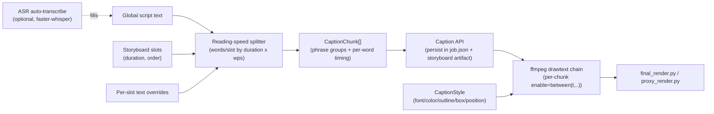

# Caption & Overlay Panel

## Current state

- [HookOverlayPanel.tsx](web/src/components/HookOverlayPanel.tsx) only edits a single static `hookText` (title), plumbed through `App.tsx` -> `JobConfig.hook` (`TitleConfig` in [config.py](src/viral_editor/config.py)).
- `drawtext_hook_overlay()` in [filter_builders.py](src/viral_editor/video/filter_builders.py:255) draws that one title on the first/hook segment only, with **hardcoded** `fontsize=28:fontcolor=white` — `font_family`/`fill_color`/`emphasis_color` from `StyleConfig` are captured in the form but never actually reach ffmpeg.
- `resolve_drawtext_fontfile()` in [ffmpeg.py](src/viral_editor/utils/ffmpeg.py:101) only resolves one system font per OS (Arial/Segoe/DejaVu) — there is no real multi-font support today; the 8 fonts listed in `fonts.ts` are cosmetic only.
- `StorySlot`/`Storyboard` ([models.py](src/viral_editor/models.py:229)) have no caption/text fields — captions are a net-new concept layered on the existing per-clip slot timeline.

## Data model & architecture

- New backend module `src/viral_editor/audio/captions.py`:
  - `WPS_PRESETS`: `[(3, "Accessible"), (4, "Comfortable"), (5, "Recommended"), (6, "Energetic"), (7.5, "Hype")]` — heuristic derived from average short-form caption pacing (continuous reading ~250-300 wpm ≈ 4.2-5 wps; burst on-screen phrases read faster due to short-term chunking, hence 5 wps is the recommended default).
  - `split_script_into_chunks(script_text, slots, words_per_second, overrides) -> dict[slot_id, list[CaptionChunk]]`: tokenizes words, distributes proportional to `slot.target_duration_s * wps`, groups into 2-4 word phrase chunks, assigns even start/end sub-timing per chunk (and per-word timing within a chunk for karaoke).
  - `suggested_word_count(duration_s, wps) -> int` used by the UI to show "3.0s slot -> 15 words".
- New models in [models.py](src/viral_editor/models.py): `CaptionWord` (text, start_s, end_s, emphasis), `CaptionChunk` (words, start_s, end_s), `CaptionStyle` (font_family, fill_color, outline_color, outline_enabled, box_enabled, box_color, position: top/center/bottom, size_scale).
- New config in [config.py](src/viral_editor/config.py): `CaptionConfig` (script_text, words_per_second, style: CaptionStyle, slot_overrides: dict[str,str], word_timing_overrides). Keep the existing `hook: TitleConfig` + its own `hook_style: CaptionStyle` (title and captions get independent style objects per your answer).
- Font registry: bundle a handful of OFL-licensed TTFs (Anton, Bebas Neue, Oswald, Montserrat Black, Barlow Condensed Black, Impact/Arial Black system fallback) under `src/viral_editor/assets/fonts/`, plus `src/viral_editor/utils/fonts.py::resolve_font(family) -> Path` replacing the single-font `resolve_drawtext_fontfile()`. Reused by both title and caption rendering, and by `web/src/constants/fonts.ts` (single source of truth list, exposed via a small `/fonts` API or duplicated constant).
- Text metrics: `src/viral_editor/utils/text_metrics.py` using Pillow (`ImageFont.getlength`) against the bundled TTFs to precompute per-word pixel widths -> x-offsets, needed for (a) centering phrase chunks and (b) the karaoke per-word highlight overlay.

## Rendering changes ([filter_builders.py](src/viral_editor/video/filter_builders.py))

- Replace `drawtext_hook_overlay` with a general `styled_drawtext(parts, input_ref, text, style, label, *, enable_expr=None)` supporting font family lookup, outline (`borderw`/`bordercolor`), box (`boxcolor`/`boxborderw`), and position (`y=` expression for top/center/bottom + safe padding pct).
- Add `build_caption_filter_chain(parts, input_ref, chunks_by_slot, segments, style, label_prefix)`: for each segment/slot, emit one base `drawtext` per phrase chunk gated with `enable='between(t,{start},{end})'`; when karaoke is enabled, overlay a second `drawtext` per word using precomputed x-offset and its own `enable` window in the emphasis color, layered on top of the base phrase.
- Wire into `build_composite_filtergraph` (proxy preview) and the final-render filter graph in [final_render.py](src/viral_editor/video/final_render.py) so captions render identically in the phone preview and final export.

## API changes

- [schemas.py](src/viral_editor/api/schemas.py) / [routes/jobs.py](src/viral_editor/api/routes/jobs.py): add `CaptionStylePatch`, `CaptionPatchRequest` (script_text, words_per_second, style, slot_overrides, word_timing_overrides) and a new `PATCH /jobs/{id}/caption` route; extend `StoryboardResponse`/`_storyboard_response()` to include computed `caption_chunks` per slot so the UI can preview without re-deriving the split logic client-side.
- New `POST /jobs/{id}/caption/transcribe` route: runs ASR (see below) against the job's audio in the background (reuse the existing job-store async pattern from [render_job.py](src/viral_editor/api/render_job.py)), returns transcript text + word timestamps to prefill the script and word-timing overrides.
- Persist `CaptionConfig` in `job.json` (via [store.py](src/viral_editor/api/store.py)) alongside the storyboard artifact, matching how `persist_storyboard_for_job` works in [api/storyboard.py](src/viral_editor/api/storyboard.py).

## ASR auto-transcribe

- Add `faster-whisper` as a dependency in [requirements.txt](requirements.txt) (CPU-friendly, CTranslate2-based, reuses the existing `torch` footprint pulled in for `demucs`). Guard import similar to `ffmpeg_available()` — degrade gracefully with a clear UI message if the model/package isn't installed.
- `src/viral_editor/audio/transcribe.py::transcribe_audio(path) -> list[CaptionWord]` (word-level timestamps) feeding directly into the same `CaptionChunk` structures used by the manual-split path, so downstream rendering code is agnostic to the caption source.

## Frontend changes

- Rename/extend `HookOverlayPanel.tsx` -> `CaptionPanel.tsx` (keep existing Title fields as a sub-section) adding:
  - Body caption script `<textarea>`.
  - WPS `<select>` sourced from `WPS_PRESETS`, default entry labeled "5 words/sec — Recommended (based on viral caption pacing)".
  - Per-slot list (mirrors `StoryboardPanel`'s slot bar): label, duration, suggested word count (`duration * wps`), actual word count assigned, inline-editable override textarea per slot, warning styling when a slot is over/under-packed.
  - Style controls: font `<select>` (bundled fonts), fill/outline/box color pickers, outline+box toggles, position radio (top/center/bottom), and one-click style presets (Bold Impact / Clean Subtitle / Neon Pop) that set multiple fields at once but remain further editable.
  - "Auto-transcribe from audio" button hitting the new transcribe endpoint with a progress/spinner state.
  - Karaoke toggle (per-word highlight on/off).
- New `components/CaptionWordTimeline.tsx`: small per-slot draggable timeline for nudging word/phrase boundaries (manual fine-tune), reusing drag patterns from [ClipCropTimeline.tsx](web/src/components/ClipCropTimeline.tsx).
- Safe-zone overlay: a new transparent overlay layer (toggleable) drawn on top of `StoryboardBlockPlayer`'s phone preview showing approximate TikTok/IG UI safe zones (like/comment rail, caption bar, bottom nav) so users can see if captions collide with platform chrome.
- [types.ts](web/src/types.ts), [client.ts](web/src/api/client.ts): add `CaptionStyle`, `CaptionChunk`, `CaptionConfig` types and `fetchCaption`/`patchCaption`/`transcribeCaption` client calls.
- [fonts.ts](web/src/constants/fonts.ts): expand with the bundled caption/title font set (single shared list per your "font registry" answer), plus a new `constants/captionPresets.ts` for the style presets.

## Testing

- `tests/test_captions.py`: splitting algorithm (word distribution per slot, phrase grouping, suggested word counts), WPS preset table.
- Extend `tests/test_final_render.py` / `tests/test_proxy_render.py` for the new caption filter chain (assert `drawtext` + `enable=between` fragments appear per chunk, font path resolution per family).
- Extend `tests/test_api.py` for the new caption PATCH/transcribe routes.

## Suggested build order (todos below)

1. Backend data model + split algorithm + WPS presets (no rendering yet).
2. Font registry + bundled font assets + text metrics util.
3. ffmpeg caption filter chain (base phrases, position/outline/box, no karaoke) wired into proxy + final render.
4. API routes + persistence for caption config.
5. Frontend `CaptionPanel` core UI (script, WPS dropdown, per-slot suggested/actual word counts, style controls, presets).
6. Karaoke per-word highlight (uses text metrics from step 2).
7. Safe-zone preview overlay in the phone preview.
8. ASR auto-transcribe (backend transcribe route + `faster-whisper` + frontend button).
9. Manual word-timing drag UI (`CaptionWordTimeline`).

## Execution protocol: strict TDD (`.agents/skills/tdd/SKILL.md`)

Every todo below is implemented as a Red -> Green -> Refactor loop, one behavior at a time. No functional code is written before a failing test exists for it.

- **Phase 1 — Contextual Impact Mapping**: before touching a module, run its existing baseline tests first (clean-environment check).
  - Python: activate venv, then `python -m pytest tests/... -v` (e.g. `tests/test_final_render.py`, `tests/test_proxy_render.py`, `tests/test_api.py`, `tests/test_storyboard.py`).
  - Frontend: `cd web && npm test -- --run`.
- **Phase 2 — Red**: write exactly one isolated, descriptively-named test (e.g. `test_split_script_distributes_words_by_slot_duration`), run it, and capture the actual failure output before writing any implementation.
- **Phase 3 — Green**: write the minimal code to pass that single test only — no speculative extra behavior (e.g. don't implement karaoke while making the base phrase-split test pass).
- **Phase 4 — Refactor**: once green, clean up, rerun the full module suite to check for regressions, then commit atomically (one behavior per commit, e.g. `feat(captions): split script into per-slot word chunks`).
- Applies per-todo, in small slices, roughly in this order per unit:
  1. `captions.py` — one test per behavior: word tokenization, proportional distribution by duration, phrase grouping size, `suggested_word_count`, WPS preset table shape.
  2. `fonts.py` / `text_metrics.py` — one test per font resolution case + word-width measurement determinism.
  3. `filter_builders.py` caption chain — one test per filter fragment (base drawtext presence, `enable=between` window, outline args, box args, position expression), before wiring into `final_render.py`/`proxy_render.py`.
  4. API routes/schemas — one test per endpoint behavior (patch persists script, patch persists style, transcribe route stub/contract).
  5. Frontend `CaptionPanel` — component tests (Vitest) per interaction: WPS dropdown changes suggested counts, per-slot override edits, style preset applies expected fields — before wiring real API calls.
  6. Karaoke, safe-zone overlay, ASR, manual word-timing — same one-test-first cadence, each as its own small red/green/refactor slice and commit, layered only after the base (non-karaoke, non-ASR) path is green end-to-end.
