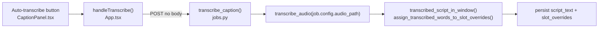
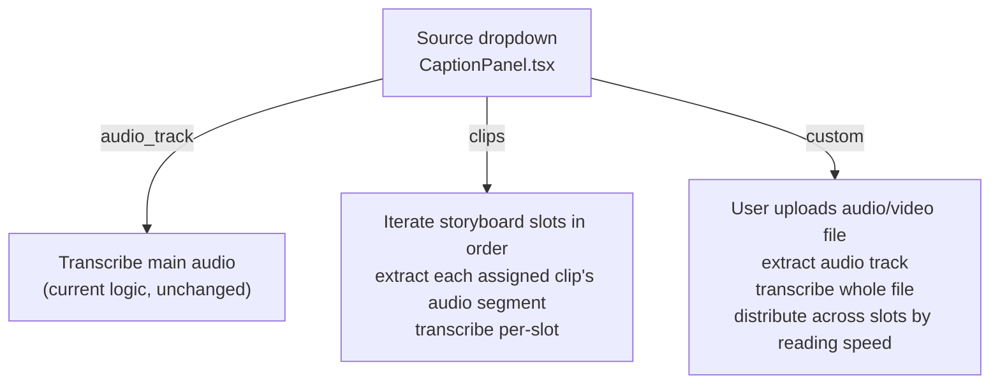
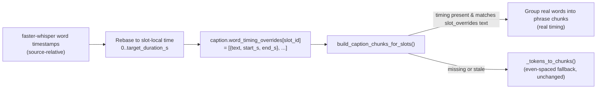

# Extend Auto-transcribe to support multiple audio sources

## Current behavior (baseline)

`POST /api/jobs/{job_id}/caption/transcribe` (`transcribe_caption()` in [src/viral_editor/api/routes/jobs.py](src/viral_editor/api/routes/jobs.py)) always transcribes `job.config.audio_path` (the main uploaded music track) with `transcribe_audio()` in [src/viral_editor/audio/transcribe.py](src/viral_editor/audio/transcribe.py), then filters/buckets the words into storyboard slots by timestamp.



## Target behavior

Add a `source` selector with three modes, all going through one extended endpoint:



## Timestamped captions — carry real ASR timing forward (new requirement)

Today, per-slot caption timing shown by `CaptionWordTimeline.tsx` and used for `drawtext enable=between` in rendering is **entirely synthetic**: `_tokens_to_chunks()` in [src/viral_editor/audio/captions.py](src/viral_editor/audio/captions.py) (line ~198) evenly spaces words across `slot.target_duration_s` regardless of how the text was produced. Auto-transcribe currently throws away Whisper's real per-word `start_s`/`end_s` after using them only to bucket text into slots.

`CaptionConfig` already has an unused field for exactly this purpose — [src/viral_editor/config.py](src/viral_editor/config.py) line 102:

```102:102:src/viral_editor/config.py
    word_timing_overrides: dict[str, list[dict[str, float | str]]] = Field(default_factory=dict)
```

This phase wires it up: every transcribe mode writes real, slot-local word timestamps here, and the chunk builder prefers them over synthetic timing when present. This gives the next phase (audio-matched caption display) a persisted, per-slot ground truth to build on, without changing the `CaptionChunk`/`CaptionWordResponse` API shape the frontend already consumes.



### Per-mode timestamp rebasing

Each mode produces timestamps in a different coordinate space; all must be converted to **slot-local time** (`0..slot.target_duration_s`, matching what `CaptionWordTimeline` already expects) before storing:

- **`audio_track`** — words are absolute time in the full track. Add `assign_transcribed_words_with_timing_to_slots(words, slots, *, music_start_s, music_end_s) -> dict[str, list[CaptionWord]]` alongside the existing `assign_transcribed_words_to_slot_overrides()` in [src/viral_editor/audio/captions.py](src/viral_editor/audio/captions.py): reuse the same slot-matching loop, but instead of only collecting `.text`, rebase each word to `slot_local_t = (word.midpoint_s - music_start_s) - slot.out_start_s` and clamp `[0, target_duration_s]`, keeping `start_s`/`end_s` both shifted by the same offset.
- **`clips`** — reuse `storyboard_to_segments()` from [src/viral_editor/audio/storyboard.py](src/viral_editor/audio/storyboard.py) to get each slot's authoritative `SpeedSegment` (already clamps `crop_start`/`crop_end` and applies the `punch` role multiplier — don't re-derive this math). Extract exactly `[segment.src_start_s, segment.src_end_s]` as today, but after transcribing, convert each word's extraction-relative timestamp to slot-local output time via `out_local_t = src_relative_t / segment.speed_factor` (clamped to `target_duration_s`), since a sped-up/slowed-down clip compresses/stretches its own audio relative to the output timeline.
- **`custom`** — no natural slot alignment exists. Use the same token-index bookkeeping already needed for `distribute_script_to_slot_overrides()` (via `_allocate_tokens()`): once we know which contiguous token range lands in each slot, carry over each token's *original* ASR word (not just its text) and rebase by subtracting the first assigned word's `start_s` in that slot, so the slot's stored timing starts at ~0. Document this as best-effort — total spoken duration may not match `target_duration_s` exactly (drift), and the existing drag UI in `CaptionWordTimeline.tsx` is the correction mechanism.

### Consuming stored timing — [src/viral_editor/audio/captions.py](src/viral_editor/audio/captions.py)

Modify `split_script_into_chunks()` (or `build_caption_chunks_for_slots()`, which already receives `caption_config` and could also take `word_timing_overrides`) so that for each slot with an override:

1. Look up `caption_config.word_timing_overrides.get(slot.id)`.
2. **Validate freshness lazily** (no proactive invalidation needed on every write path): rebuild the stored words' joined text and compare against `slot_overrides[slot.id]` (or the auto-allocated tokens for that slot). If they match, the timing is trustworthy.
3. If valid: group the stored `CaptionWord`s into phrase chunks (reuse `_group_into_phrases()` on the word list instead of re-tokenizing) and emit `CaptionChunk`s with the **real** `start_s`/`end_s` already present — skip the synthetic even-spacing math entirely for that slot.
4. If missing or stale (user hand-edited the override text after transcribing, or WPS/manual distribution overwrote it): fall back to today's `_tokens_to_chunks()` synthetic path, unchanged.

This keeps the fallback self-healing — no need to hunt down every code path that mutates `slot_overrides` and remember to clear stale timing.

### Schema note

`word_timing_overrides` stores `{"text": str, "start_s": float, "end_s": float}` per word (no `emphasis` field — emphasis continues to be computed at chunk-build time from `emphasis_words`, keeping the stored shape simple and matching the field's existing `dict[str, float | str]` value type).

## Backend changes

### 1. New audio extraction helper — [src/viral_editor/audio/transcribe.py](src/viral_editor/audio/transcribe.py)

Add `extract_audio_track(source: Path, dest: Path, *, start_s: float | None = None, end_s: float | None = None) -> Path` using `run_ffmpeg()` from [src/viral_editor/utils/ffmpeg.py](src/viral_editor/utils/ffmpeg.py):

```python
def extract_audio_track(source: Path, dest: Path, *, start_s: float | None = None, end_s: float | None = None) -> Path:
    args = []
    if start_s is not None:
        args += ["-ss", f"{start_s:.3f}"]
    args += ["-i", str(source)]
    if end_s is not None:
        args += ["-to", f"{end_s:.3f}"]
    args += ["-vn", "-ac", "1", "-ar", "16000", "-y", str(dest)]
    run_ffmpeg(args)
    return dest
```

Used for both the "clips" (per-slot segment) and "custom" (video-with-audio upload) modes. `transcribe_audio()` itself is unchanged — it always receives a path to an audio-only or media file it can hand to `faster-whisper`.

### 2. Extend `/{job_id}/caption/transcribe` route — [src/viral_editor/api/routes/jobs.py](src/viral_editor/api/routes/jobs.py) (~line 1300)

Change the route to accept multipart form fields instead of a bare POST, so the same endpoint can carry an optional file upload:

```python
@router.post("/{job_id}/caption/transcribe", response_model=TranscribeCaptionResponse)
async def transcribe_caption(
    job_id: str,
    request: Request,
    source: str = Form("audio_track"),
    media: UploadFile | None = File(default=None),
) -> TranscribeCaptionResponse:
```

Branch on `source`:

- **`"audio_track"`** — existing text logic unchanged, plus: also call `assign_transcribed_words_with_timing_to_slots()` (new, see timestamping section above) to populate `word_timing_overrides` for every matched slot.
- **`"clips"`** — new helper `_transcribe_clips_per_slot(job, storyboard, clip_media)`:
  - Sort slots by `order`, keep those with `assigned_clip_id`.
  - Call `storyboard_to_segments(storyboard, clip_media)` once to get authoritative per-slot `SpeedSegment`s (source range + speed factor), keyed by `slot_ids` — reuse rather than re-deriving crop clamping/punch multiplier.
  - Skip slots whose clip media has `has_audio=False` or is missing (collect into `skipped_clip_ids`).
  - For each remaining slot, extract `[segment.src_start_s, segment.src_end_s]` into a scratch wav under `job.workspace / "temp" / "transcribe_scratch"`.
  - Run `transcribe_audio()` on each segment; set `slot_overrides[slot.id]` to the segment transcript text, and `word_timing_overrides[slot.id]` to the words rebased by `segment.speed_factor` (see above) — no time-window math needed for text, the slot mapping is 1:1 by construction.
  - `script_text` = the per-slot texts joined in slot order.
  - Clean up scratch files after (`try/finally`).
- **`"custom"`** — requires `media` file:
  - 400 if `media` is None.
  - Save upload to a scratch temp file; if it's a video (or unknown), run it through `extract_audio_track()` to a wav first (works for audio-only input too).
  - `transcribe_audio()` on the extracted wav.
  - If storyboard exists, distribute the resulting words across slots using the same token-allocation logic as `distribute_script_to_slot_overrides()` but tracking original word objects (not just text) so real timestamps can be rebased per-slot as described above; write both `slot_overrides` and `word_timing_overrides`. Otherwise (no storyboard) leave both empty and only set `script_text`.

All three modes end by persisting the same way the current fix already does: update `job.config.caption` (`script_text`, `slot_overrides`, `word_timing_overrides`), `store.update_config()`, `write_job_config()`, `_invalidate_composite_previews()`.

### 3. Schema updates — [src/viral_editor/api/schemas.py](src/viral_editor/api/schemas.py)

`TranscribeCaptionResponse` gains a `source: str` echo field (useful for the UI to confirm what ran) and optionally `skipped_clip_ids: list[str] = []` for the "clips" mode (clips with no audio track, so the UI can warn).

## Frontend changes

### 4. `web/src/api/client.ts`

Change `transcribeCaption` to send `FormData` always (simplifies to one code path):

```typescript
export async function transcribeCaption(
  jobId: string,
  source: "audio_track" | "clips" | "custom",
  mediaFile?: File,
): Promise<{ script_text: string; slot_overrides: Record<string, string>; skipped_clip_ids: string[]; transcribe_available: boolean }> {
  const form = new FormData();
  form.append("source", source);
  if (mediaFile) form.append("media", mediaFile);
  const res = await fetch(`/api/jobs/${jobId}/caption/transcribe`, { method: "POST", body: form });
  if (!res.ok) throw new Error(await parseError(res));
  return res.json();
}
```

### 5. `web/src/components/CaptionPanel.tsx`

Replace the single "Auto-transcribe" button with a small inline control group next to "Body captions":

- `<select>` (reuse `field-select` styling, same pattern as the WPS `<select>` at line ~243) with options:
  - `Transcribe from Audio Track`
  - `Transcribe from Clips (aggregated)`
  - `Transcribe from Custom Upload`
- When `"custom"` is selected, reveal a file `<input type="file" accept="audio/*,video/*">` (reuse the drop-zone pattern from [JobForm.tsx](web/src/components/JobForm.tsx) line ~73, or a simpler inline input since this is a secondary control).
- The "Auto-transcribe" button stays, calling `onTranscribe(selectedSource, selectedFile)`; disabled when `source === "custom"` and no file chosen yet, or when `transcribing`/`saving`.
- The `transcribe_available` disabling stays only for `audio_track`/`custom` modes (both use Whisper); `clips` mode also needs Whisper so it stays gated by `transcribe_available` too — all three modes need faster-whisper, no change there.

### 6. `web/src/App.tsx`

`handleTranscribe(source, file)` signature update:

```typescript
const handleTranscribe = async (source: TranscribeSource, file?: File) => {
  if (!activeJobId) return;
  setTranscribing(true);
  try {
    await transcribeCaption(activeJobId, source, file);
    const updated = await fetchCaption(activeJobId);
    setCaptionData(updated);
    refreshPreview();
  } catch (err) {
    setError(err instanceof Error ? err.message : "Transcription failed");
  } finally {
    setTranscribing(false);
  }
};
```

### 7. `web/src/types.ts`

Add `TranscribeSource = "audio_track" | "clips" | "custom"` type export, used by both `CaptionPanel` and `App.tsx`.

## Testing (TDD per `.agents/skills/tdd/SKILL.md`)

Extend [tests/test_api.py](tests/test_api.py) with one test per new mode, following the pattern of the existing `test_transcribe_caption_persists_script_and_slot_overrides`:

- `test_transcribe_caption_from_clips_builds_per_slot_overrides` — build a job with 2 clips assigned to 2 slots, monkeypatch `transcribe_audio` to return different canned text per call (assert call args include the right extracted-segment path), assert `slot_overrides` has one entry per clip-bearing slot in the right order, and clips with `has_audio=False` are skipped.
- `test_transcribe_caption_from_clips_skips_silent_clips` — a clip probed with `has_audio=False` is skipped and reported in `skipped_clip_ids`.
- `test_transcribe_caption_custom_upload_distributes_by_reading_speed` — POST multipart with a fake audio file, monkeypatch `extract_audio_track`/`transcribe_audio`, assert script + `slot_overrides` distributed like the manual-script-patch path.
- `test_transcribe_caption_rejects_missing_custom_file` — `source=custom` with no file → 400.
- `test_transcribe_caption_persists_word_timing_overrides` — after an `audio_track` transcribe, assert `caption.word_timing_overrides[slot_id]` round-trips through `GET /caption` with slot-local (not absolute) `start_s`/`end_s` values within `[0, target_duration_s]`.

Extend [tests/test_captions.py](tests/test_captions.py) with the new pure functions:

- `test_assign_transcribed_words_with_timing_to_slots_rebases_to_slot_local_time` — mirrors the existing `test_assign_transcribed_words_to_slot_overrides_maps_by_storyboard_time` fixture, asserting returned `CaptionWord.start_s`/`end_s` are slot-local (start near 0), not absolute.
- `test_split_script_into_chunks_prefers_valid_word_timing_override` — given a slot with a matching `word_timing_overrides` entry, assert the emitted `CaptionChunk` words carry the stored (non-even-spaced) timestamps.
- `test_split_script_into_chunks_falls_back_when_timing_override_is_stale` — override text no longer matches `slot_overrides[slot_id]` (simulating a manual edit after transcribe) → falls back to synthetic `_tokens_to_chunks()` timing, unchanged from today.

Run baseline first: `& c:/Sources/ViralAutomation/.venv/Scripts/Activate.ps1; python -m pytest tests/test_api.py tests/test_captions.py -q`.

## Open implementation notes

- Whisper model load (`WhisperModel("base", ...)`) currently happens fresh per call in `transcribe_audio()`. The "clips" mode calls this once per clip — for jobs with many clips this could be slow (each call reloads the model). Out of scope to fix now, but worth flagging; a follow-up could hoist model loading to module-level cache if this becomes a real pain point.
- Scratch files for "clips" and "custom" modes go under `job.workspace / "temp" / "transcribe_scratch"` and are deleted after the request completes (success or failure) via `try/finally`.
- `custom` mode's per-slot timing is genuinely best-effort (arbitrary audio has no ground-truth alignment to storyboard slots) — this is acceptable as a "phase 1" input to the next phase's audio-matched display work, refined later via the existing `CaptionWordTimeline` drag UI.
- The lazy "does stored timing text match current override text" validation means no changes are needed to `patch_caption()`'s existing manual-edit code paths — stale timing is simply ignored at read time rather than proactively cleared at write time.
