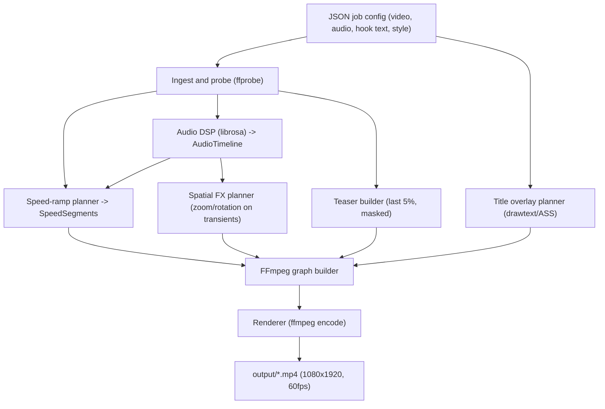

## Automated Retention Video Editor - Local Core Loop Breakdown

Stack locked from clarifications: Python orchestration, FFmpeg `filter_complex` rendering, CLI interface, `venv` + `requirements.txt`, output `1080x1920 / H.264+AAC / 60fps`, separate music track input. User will provide sample assets. FFmpeg install handled as a setup step.

### Architecture

A single synchronous pipeline now, but split into independent, testable modules so each stage can later become a worker/service. Each stage consumes typed domain models and produces JSON-serializable artifacts (inspectable on disk for debugging).



### Proposed project structure

```
ViralAutomation/
  README.md
  requirements.txt
  .gitignore
  config/job.example.json
  assets/            # user-provided sample video + music
  output/            # gitignored
  temp/              # gitignored intermediates (per-stage JSON + clips)
  src/viral_editor/
    cli.py           # entrypoint (argparse/typer)
    config.py        # pydantic models: JobConfig, StyleConfig, RenderConfig
    models.py        # Transient, AudioTimeline, SpeedSegment, FxEvent, MediaInfo
    pipeline.py      # orchestrates the full core loop
    utils/ffmpeg.py  # ffmpeg/ffprobe wrappers + availability check
    utils/logging.py
    ingest/loader.py # validate inputs, probe media
    audio/beat_detector.py
    video/speed_ramp.py
    video/spatial_fx.py
    video/teaser.py
    overlay/title.py
    render/ffmpeg_builder.py
    render/renderer.py
  tests/
```

### Phase 0 - Scaffolding and environment
- Create repo layout above, `requirements.txt` (`librosa`, `numpy`, `scipy`, `soundfile`, `pydantic`, `typer` or stdlib `argparse`, `rich` for logging), `.gitignore` (`output/`, `temp/`, `.venv/`).
- `utils/ffmpeg.py` with `ensure_ffmpeg()` that verifies `ffmpeg`/`ffprobe` on PATH and prints Windows install guidance (winget/choco) if missing.
- `README.md` with setup + run instructions.

### Phase 1 - Config and ingestion
- `config.py`: pydantic `JobConfig` (paths to video/audio/output, hook text, `StyleConfig` for fonts/colors/safe-padding, `RenderConfig` defaulting to 1080x1920/60fps/H.264/AAC).
- `ingest/loader.py`: validate files exist, probe via `ffprobe` -> `MediaInfo` (duration, fps, resolution, has_audio). Music duration defines final output length; video is time-remapped to fill it.
- `config/job.example.json` documenting every field.

### Phase 2 - Audio DSP (BeatViz core)
- `audio/beat_detector.py`: load music with `librosa`; compute onset strength envelope, global BPM (autocorrelation/`beat_track`), transients via spectral-flux peak picking; normalize amplitudes; classify `percussive` vs `drop` (top-percentile energy peaks = drops).
- Emit `AudioTimeline` and serialize to `temp/audio_timeline.json` matching the plan's schema (`global_bpm`, `audio_duration_seconds`, `transients[]`).

### Phase 3 - Speed-ramp planner (hardest module, isolated)
- `video/speed_ramp.py`: build energy envelope `E(t)` over the music timeline; apply `R(t) = clamp(S_max - E(t)*alpha, S_min, S_max)`; force `S_min` on `drop` transients.
- Discretize into piecewise-constant `SpeedSegment`s aligned to the beat grid (FFmpeg can't do continuous `setpts`). Each segment maps an output time window to a source in/out range so total consumed footage fits the music duration (loop/trim source if shorter/longer). This source-to-output mapping is the core math; keep it pure and unit-tested.

### Phase 4 - Teaser and spatial FX
- `video/teaser.py`: extract last 5% of source as the "completed state" teaser (t=0..~2.5s), apply directional blur/vignette mask.
- `video/spatial_fx.py`: from transients produce `FxEvent`s -> zoom punch (scale 1.05-1.08 with exponential decay over ~4 frames) and small rotation shake on low-frequency hits, expressed as time-keyed FFmpeg `scale`/`crop`/`rotate` expressions.

### Phase 5 - Title overlay
- `overlay/title.py`: render hook text over the teaser window using FFmpeg `drawtext` (or an ASS subtitle file for richer multiline/pill-box control): centered multiline bounding box, 10% safe padding, duotone color emphasis, drop shadow / `rgba(0,0,0,0.85)` pill.

### Phase 6 - Render assembly and encode
- `render/ffmpeg_builder.py`: compose the full `filter_complex` from speed segments + FX + teaser + overlay; or use the segment-extract-then-concat strategy (per-segment `trim`/`setpts` clips concatenated) for reliability over one mega-graph.
- `render/renderer.py`: run FFmpeg, mux original music as the audio track, encode to spec, write to `output/`.

### Phase 7 - CLI and end-to-end core loop
- `cli.py` + `pipeline.py`: `python -m viral_editor run config/job.json`; wire all stages, structured logging, write per-stage artifacts to `temp/` for inspection, verify final mp4.
- Validate against user-provided sample assets.

### Deferred phases (wanted eventually, sensibly sequenced after the core loop works)
- Phase 8 - Retention engine: kinetic captions via Whisper ASR (word-level), progress-bar indicator, infinite loop wrap (crossfade + seamless audio loop).
- Phase 9 - Cloud/web: wrap CLI/pipeline behind FastAPI (`/jobs`), async workers, object storage + serverless/Remotion rendering option.

### Best-practice notes
- Pure functions for planners (audio, speed, fx) returning serializable models -> trivially unit-testable without FFmpeg.
- All FFmpeg invocations go through one wrapper for logging, error capture, and future swap-out.
- Domain models in `models.py` are the contract between stages, making the later move to async workers/cloud a transport change, not a rewrite.