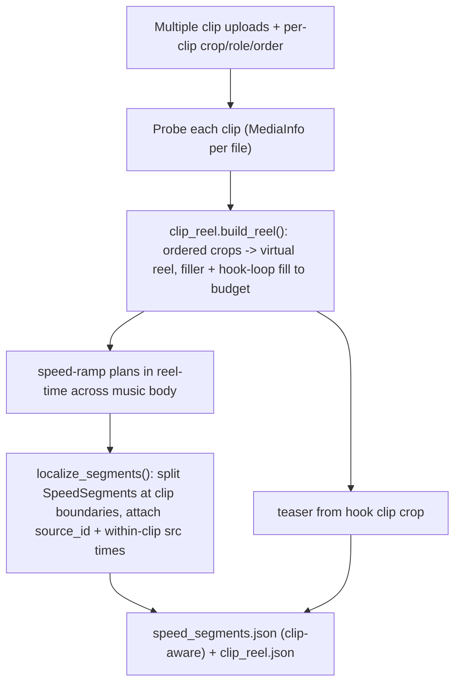

## Multi-Clip Reel Composer

### Decisions locked
- Composition: build an ordered **clip reel** from each clip's crop range, concatenate into one virtual source, then let the current speed-ramp warp that reel across the music body. Clip order = on-screen order; filler/hook extend the reel to reach target length.
- Hook clip = Phase 4 frame-0 teaser source AND the loop used to fill remaining body time.
- Crop in/out times are soft suggestions: clip-boundary cut points get snapped to the beat grid (reuse existing downbeat snapping).

### Flow

### Phase 1 - Domain models ([src/viral_editor/models.py](src/viral_editor/models.py))
- New `ClipRole = Literal["clip", "hook", "filler"]`.
- New `ClipInput(DomainModel)`: `id`, `path: Path`, `order: int`, `included: bool=True`, `role: ClipRole="clip"`, `crop_start_s: float|None`, `crop_end_s: float|None`.
- New `ReelEntry(DomainModel)`: `clip_id`, `path`, `reel_start_s`, `reel_end_s`, `src_start_s`, `src_end_s`, `is_hook_loop: bool`.
- New `ClipReel(DomainModel)`: `entries: list[ReelEntry]`, `reel_duration_s`, plus a cumulative offset map helper.
- Extend `SpeedSegment` with `source_id: str | None = None` (clip id; `None` keeps single-source back-compat).
- Extend `TeaserSpec` with `source_id: str | None = None` and `source_path: Path | None = None`.

### Phase 2 - Config ([src/viral_editor/config.py](src/viral_editor/config.py))
- Add `clips: list[ClipInput] = []` to `JobConfig`; keep `video_path: Path | None` optional for back-compat. Validator: require either `clips` (>=1 included) or `video_path`. `JobConfig.load` resolves each clip path.
- Helper `JobConfig.effective_clips()` -> list (wraps a lone `video_path` as a single full-length `clip`).

### Phase 3 - Ingest ([src/viral_editor/ingest/loader.py](src/viral_editor/ingest/loader.py))
- `validate_job` probes every included clip (reuse `probe_media`), validates each has a video stream, and validates crop ranges fall within each clip duration.
- `IngestResult` gains `clips: list[MediaInfo]` (keep `video` = first/primary for back-compat).

### Phase 4 - Reel builder (new [src/viral_editor/video/clip_reel.py](src/viral_editor/video/clip_reel.py))
- `build_reel(clips, clip_media, *, body_output_duration_s, preset) -> ClipReel`:
  1. Ordered `role=="clip"` included clips -> entries from their crop ranges (default crop = whole clip).
  2. If reel shorter than the source budget needed to cover the body within `[s_min, s_max]`, append `role=="filler"` clips (cropped or whole), then loop the `role=="hook"` clip until the budget is met (`is_hook_loop=True`).
  3. Produce `reel_duration_s` and cumulative offsets.
- `localize_segments(segments, reel) -> list[SpeedSegment]`: split each reel-time `SpeedSegment` at `ReelEntry` boundaries and rewrite `src_start_s/src_end_s` to within-clip times, setting `source_id`.

### Phase 5 - Speed-ramp integration ([src/viral_editor/video/speed_ramp.py](src/viral_editor/video/speed_ramp.py))
- `_plan_with_preset` / `plan_speed_options` accept a `ClipReel` and use `reel.reel_duration_s` as `src_duration_s` (reel becomes "the source"). After `_snap_segments_to_frames`, call `localize_segments`.
- Add clip-boundary reel times as forced boundaries in `_beat_grid_boundaries`, snapped to nearest downbeat (the "shift for transitions/beats" behavior).
- Keep `cap_output_duration_to_source` as the final safety net (reel fill normally prevents capping).

### Phase 6 - Teaser + proxy ([src/viral_editor/video/teaser.py](src/viral_editor/video/teaser.py), [src/viral_editor/video/proxy_render.py](src/viral_editor/video/proxy_render.py))
- `build_teaser_spec` sources from the hook clip's crop (fallback: tail of first clip), setting `source_id`/`source_path`.
- `build_proxy_filtergraph` / `render_speed_proxy`: accept the set of clip inputs, add one ffmpeg `-i` per distinct clip used, and pick the input index per segment from `source_id` (instead of always `[0:v]`).

### Phase 7 - Pipeline + API
- [src/viral_editor/pipeline.py](src/viral_editor/pipeline.py): build reel after ingest, write new `clip_reel.json` artifact, pass reel to speed planner, source teaser from hook clip.
- [src/viral_editor/api/runner.py](src/viral_editor/api/runner.py) `build_job_config`: accept clip list/metadata.
- [src/viral_editor/api/routes/jobs.py](src/viral_editor/api/routes/jobs.py) `create_job`: accept multiple `video` files (`list[UploadFile]`) + a JSON `clips` field (order/role/crop). Save each upload. Add `GET /jobs/{id}/clips` (per-clip probed metadata) and `PATCH /jobs/{id}/clips` (update selection/crop/role + recompute reel & speed options, mirroring `refresh_music_selection`/`refresh_speed_selection` in [src/viral_editor/api/speed.py](src/viral_editor/api/speed.py)).
- [src/viral_editor/api/schemas.py](src/viral_editor/api/schemas.py): `ClipUpdate` / `ClipReelResponse`.

### Phase 8 - Frontend (per `frontend-design`, extend Control Room identity)
- Multi-file dropzone in [web/src/components/JobForm.tsx](web/src/components/JobForm.tsx) (drag many; `multiple`), feeding a new **Clip Reel** panel.
- New [web/src/components/ClipReelPanel.tsx](web/src/components/ClipReelPanel.tsx): the signature element - a horizontal "filmstrip / patchbay" reel of clip cards in order (keyboard-reorderable), each with include toggle, role selector (Clip / Hook / Filler), and a running reel-length-vs-target readout in JetBrains Mono. Hook card uses hook-gold; filler cards muted.
- New [web/src/components/ClipCropTimeline.tsx](web/src/components/ClipCropTimeline.tsx): per-clip in/out crop handles over a scrubbable `<video>` (local object URL; read duration client-side), phosphor-green trace styling consistent with `ScopeCanvas`/`SpeedCurveCanvas`.
- Wire [web/src/api/client.ts](web/src/api/client.ts), [web/src/types.ts](web/src/types.ts), [web/src/App.tsx](web/src/App.tsx): multi-file create, `fetchClips`, `updateClips`; reuse existing loading/error patterns. Keep boldness on the reel; everything else stays quiet.

### Phase 9 - Tests
- `tests/test_clip_reel.py`: ordered reel assembly; filler then hook-loop fill to budget; `localize_segments` splits at boundaries with correct within-clip times and `source_id`; determinism.
- Extend `tests/test_speed_ramp.py` (reel input, clip-boundary snapping), `tests/test_teaser.py` (hook-clip source), `tests/test_proxy_render.py` (multi-input filtergraph), `tests/test_config.py`/`test_models.py` (clips + back-compat), and API tests for multi-upload + `PATCH /clips`.

### Back-compat
A lone `video_path` (no `clips`) is treated as a single full-length `clip`, so all existing single-video tests, the pipeline, and `SpeedSegment` consumers keep working unchanged.
</plan>
<todos>[{"id": "models", "content": "Add ClipInput/ReelEntry/ClipReel models, ClipRole; extend SpeedSegment.source_id and TeaserSpec source fields in models.py"}, {"id": "config", "content": "Add clips list to JobConfig with validation + effective_clips() back-compat helper in config.py"}, {"id": "ingest", "content": "Probe all clips, validate crops, add IngestResult.clips in ingest/loader.py"}, {"id": "reel", "content": "Create video/clip_reel.py: build_reel() and localize_segments()"}, {"id": "speedramp", "content": "Make speed_ramp consume ClipReel, snap clip boundaries to beats, localize segments"}, {"id": "teaser-proxy", "content": "Source teaser from hook clip; make proxy_render multi-input"}, {"id": "pipeline-api", "content": "Wire reel into pipeline + clip_reel.json; multi-file create_job, GET/PATCH /clips, schemas, runner"}, {"id": "frontend", "content": "Multi-file dropzone, ClipReelPanel filmstrip, ClipCropTimeline; wire client.ts/types.ts/App.tsx per frontend-design"}, {"id": "tests", "content": "Add test_clip_reel; extend speed_ramp/teaser/proxy/config/models + API tests for multi-clip & PATCH /clips"}]