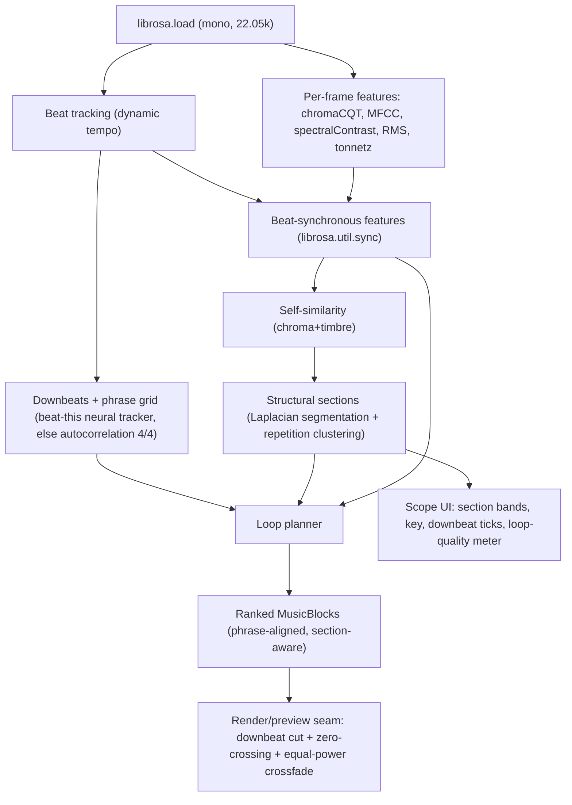

## Sophisticated Loop & Section Engine

### Why the current result still feels abrupt

[block_planner.py](src/viral_editor/audio/block_planner.py) relies on:
- One `global_bpm` grid for the whole track. Over a multi-minute song, tempo and phase drift, so "bar boundaries" stop landing on real downbeats.
- Head/tail correlation of the onset envelope + flattened chroma, with fixed `hop` slices (not beat-aligned).
- No knowledge of song structure, so a window can start mid-phrase or cut across a chorus.

Best-practice MIR fixes this with beat-synchronous features, downbeat/phrase alignment, and structural self-similarity. Heavy deps are acceptable and the app ships fully containerized, so we use the strongest available method (the `beat-this` neural tracker) with a librosa-only fallback for native dev.

### Target architecture

### Principles applied
- Beat-synchronous analysis (the MIR standard) instead of fixed hop windows.
- Phrase structure: pop/EDM is organized in 4/8/16-bar phrases starting on downbeats; loops that span whole phrases sound complete.
- Repetition = loopability: a section that already repeats in the song (e.g. chorus/drop) is naturally seamless and is also the highest-retention hook.
- Multi-feature seam continuity: match harmony (chroma/tonnetz), timbre (MFCC), and energy (RMS) across the loop junction, not a single envelope point.
- Render-grade seam: cut on a downbeat, snap to a zero-crossing, equal-power (constant-power) crossfade to remove clicks.

---

### Phase A - Beat-synchronous analysis foundation
File: [beat_detector.py](src/viral_editor/audio/beat_detector.py)
- Primary beat/downbeat engine: `beat-this` ([CPJKU/beat_this](https://github.com/CPJKU/beat_this), ISMIR 2024, PyTorch). It returns both beat and downbeat times directly, no madmom/DBN required, and runs on Python 3.12. Wrap it behind a thin `infer_beats()` adapter so the engine is swappable.
  - Model weights cached to a known dir (mounted as a volume in the container) so inference is offline after first pull.
- Fallback (no torch / native dev): `librosa.beat.beat_track` for beats + downbeat estimation via autocorrelation of a beat-synchronous novelty curve (assume 4/4, pick the downbeat phase maximizing onset energy). Selected automatically when `beat_this`/`torch` import fails.
- Keep `global_bpm` (from beat intervals) for display.
- Compute per-frame features: `chroma_cqt`, `mfcc`, `spectral_contrast`, `rms`, `tonnetz`; aggregate beat-synchronously with `librosa.util.sync` (median).
- Estimate musical key (Krumhansl-Schmuckler from mean chroma) for labeling/harmonic checks.
- Persist a single `features.npz` (beats, downbeats, beat-sync matrices, key, engine name) alongside existing `onset_envelope.npy`/`chroma.npy`; add `save_features()`. Extend `AudioAnalysisResult`.
- Determinism: `torch` inference in eval/no-grad on CPU with fixed seeds; fix all `random_state`; record which engine ran in telemetry + artifact.

### Phase B - Structural segmentation
New file: `src/viral_editor/audio/structure.py`
- Build a combined recurrence/self-similarity matrix from beat-sync chroma (harmony) + MFCC (timbre), e.g. `librosa.segment.recurrence_matrix` with `mode='affinity'`, plus a sequence (path) term.
- Segment via the Laplacian/spectral method (McFee structural decomposition) or Foote novelty peaks, snapping boundaries to downbeats.
- Cluster segments so repeated sections share a label; compute per-section repetition count, mean RMS energy, and drop density.
- Output `MusicSection(start_s, end_s, start_beat, end_beat, label, repetition_count, energy, is_repeated)`.
- Dependencies in [pyproject.toml](pyproject.toml) + [requirements.txt](requirements.txt): add `scikit-learn` (librosa spectral clustering) to core; add an `audio-nn` extra = `torch` (CPU wheel) + `beat-this`. The container installs the `audio-nn` extra; native dev can skip it and use the librosa fallback.

### Phase C - Loop & window planner rewrite
File: [block_planner.py](src/viral_editor/audio/block_planner.py)
- Candidate generation: only starts on downbeats; durations are whole phrases (4/8/16 bars) within the target +/- drift (keep `LOOP_MAX_DRIFT_RATIO`, allow phrase override).
- Section-aware: prefer windows aligned to a structural section, especially `is_repeated` sections (hook). Boost score when window == one full repeated section or an integer number of its phrases.
- Multi-feature loop seam score (beat-synchronous):
  - Continuity: similarity of the N beats after `start` vs the N beats after `end` (does the music continue naturally on wrap), over chroma + MFCC + RMS.
  - Phrase repetition: existing head/tail term, but on beat-sync features.
  - Harmonic seam: tonnetz/key distance between last and first beat.
- Retention score: section energy, drop near start, onset density (hook strength).
- Final score = weighted blend (musically tuned), deterministic. Refine end by +/- 1 beat to maximize seam.
- Extend `MusicBlock` in [models.py](src/viral_editor/models.py): `loop_quality: float`, `phrase_bars: int`, `section_label: str | None`, `key: str | None`, `is_repeated_section: bool`. Update `reason` copy (e.g. "8-bar chorus, repeats 3x, seamless").

### Phase D - Render-grade seamless loop
File: [preview.py](src/viral_editor/audio/preview.py) (and reused by future render)
- Cut exactly on the chosen downbeat times; snap both cut points to the nearest zero-crossing to avoid clicks.
- Equal-power (constant-power) crossfade across the seam (replace the current `acrossfade` audition-only path with a shared helper) so audition == final render seam.
- Loop the true render seam in audition so what the user hears matches output.

### Phase E - Scope UI
Files: [AudioScopePanel.tsx](web/src/components/AudioScopePanel.tsx), [ScopeCanvas.tsx](web/src/components/ScopeCanvas.tsx), [MusicBlockCard.tsx](web/src/components/MusicBlockCard.tsx), [types.ts](web/src/types.ts), [api/music.py](src/viral_editor/api/music.py), [routes/jobs.py](src/viral_editor/api/routes/jobs.py)
- Waveform payload gains sections (colored bands), downbeat ticks, and key; render section bands behind the trace and downbeat markers distinct from transient ticks.
- Block cards show a loop-quality meter, phrase length, section label, and key; sort by loop quality.
- Keep Control Room tokens (`#3DDC84` trace, `#F4C430` drops/selected, `#38BDF8` bass); sections use low-opacity fills.

### Phase F - Full containerization (API + analysis + ffmpeg)
New files: `Dockerfile`, `.dockerignore`, `docker-compose.yml`; small change to [api/main.py](src/viral_editor/api/main.py)
- Multi-stage build:
  - Stage 1 (node): `npm ci && npm run build` in [web/](web/) -> static `dist/`.
  - Stage 2 (python:3.12-slim): `apt-get install -y ffmpeg`; `pip install .[ui,audio-nn]`; copy built `dist/`.
- Serve the built UI statically from FastAPI so one container exposes both UI and API on one port: add a `StaticFiles` mount in [api/main.py](src/viral_editor/api/main.py) (serve `dist/` at `/`, keep `/api/*`). In the container the dev Vite proxy is not used; native dev keeps Vite on 5173 -> API 8765.
- `torch` CPU-only wheels (use the CPU index URL) to keep the image portable and avoid CUDA; `beat-this` model weights cached to `/models` (mounted volume) on first run.
- `docker-compose.yml`:
  - one `app` service, `ports: 8765:8765`.
  - volumes: host `input/`, `output/`, `temp/` bind-mounts (so users drop files and get results on the host) + a named `model-cache` volume for torch/beat-this weights.
  - env for ffmpeg path (Linux PATH already resolves; `resolve_ffmpeg_binary` finds `/usr/bin/ffmpeg`).
- ffmpeg discovery: confirm [utils/ffmpeg.py](src/viral_editor/utils/ffmpeg.py) finds the Linux binary on PATH (WinGet path logic is a no-op there).
- Docs: README run section -> `docker compose up` (primary) and the native `python -m viral_editor serve` path (dev/fallback).

### Testing
- `tests/test_structure.py`: synthetic ABAB track (two alternating timbres/keys) -> boundaries on section changes; repeated label detected.
- Extend `tests/test_block_planner.py`: downbeat-aligned starts; whole-phrase durations; periodic signal -> high `loop_quality`; deterministic.
- `tests/test_beat_detector.py`: beats monotonic; downbeats subset of beats; feature matrices shaped `(n_features, n_beats)`; madmom-absent fallback path.
- API: waveform returns sections/downbeats/key; preview still 200 with new seam helper.

### Rollout / risk
- Primary runtime is the container (`docker compose up`), where `beat-this` + torch CPU install cleanly on Linux/py3.12 - this sidesteps the Windows/madmom build problem entirely. The librosa-only fallback keeps native `python -m viral_editor serve` working without torch.
- Image size: torch CPU + librosa is large (~1.5-2 GB). Mitigate with CPU-only wheels, slim base, and layer caching; document first-run model download.
- Volume/path translation on Windows hosts: use bind mounts declared in compose; the app already writes under `temp/jobs/<id>/...` so mounting `temp/`, `input/`, `output/` is sufficient.
- New analysis cost is higher; keep it in the existing `audio` stage and persist `features.npz` so the planner/PATCH re-suggest stays fast.
- Engine identity is recorded per job so results are reproducible and the UI can show whether neural or fallback tracking was used.