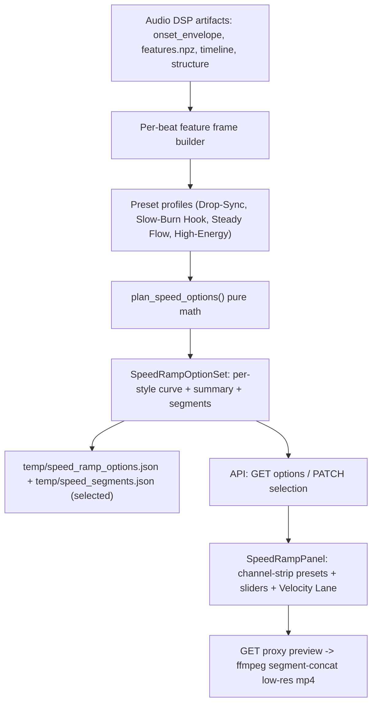

## Speed Ramp Options Engine

### Goal
Use every signal from Audio DSP to decide *when* and *how long* to ramp, give the user a few viral-hook-tuned presets (plus fine-tuning), and let them preview each as a speed curve and a low-res proxy video before locking it in.

### Why this matters for viral hooks
The first ~2s decides retention. Speed should breathe on the hook, accelerate through build-ups, and snap to slow-mo on the drop. Today only `onset_envelope` + 3 drops drive speed, `alpha` defaults to 0 (constant max), and boundaries ignore the beat grid. We are leaving downbeats, beat-sync RMS, bass/percussive transients, and structural sections unused.

### Data utilization (current vs target)

- onset_envelope -> energy->speed: used now, keep as one input
- `features.npz` beats/downbeats: UNUSED -> snap segment boundaries to beats/downbeats (musical cuts)
- `features.npz` rms_sync (per-beat energy): UNUSED -> primary smooth energy signal
- transients `drop`: partial -> hard slow-hold + on-beat freeze
- transients `bass`: UNUSED -> secondary slow accents
- transients `percussive` density: UNUSED -> build-up acceleration (hook tension)
- `music_structure.json` sections (energy, is_repeated): UNUSED -> section-aware speed targets (slow the hook/chorus, accelerate the build)
- key/engine: UI only

### Architecture

### Backend

1. Models in [src/viral_editor/models.py](src/viral_editor/models.py)
   - `SpeedCurvePoint(t, speed)`.
   - Extend `SpeedRampPlan` with presentation/summary: `style: str`, `avg_speed`, `max_speed`, `min_speed`, `slow_zone_count`, `speed_curve: list[SpeedCurvePoint]` (downsampled, for the UI overlay). `segments` stays the Phase 6 contract.
   - `SpeedRampOption(style, label, description, plan: SpeedRampPlan)` and `SpeedRampOptionSet(selected_style, options: list[SpeedRampOption])`.

2. New [src/viral_editor/video/speed_presets.py](src/viral_editor/video/speed_presets.py)
   - `@dataclass SpeedPreset` of tuning weights: `alpha`, `s_min`, `s_max`, `drop_hold_ms`, `bass_accent` (0-1), `density_gain` (0-1), `section_bias` (0-1), `snap_mode` ("beat"|"downbeat"|"grid"), plus `label`, `description`.
   - `PRESETS: dict[str, SpeedPreset]` with 4 hook-oriented profiles:
     - `drop_sync`: high `s_max`, strong build via density, hard freeze on drops snapped to downbeats. Music-reveal energy.
     - `slow_burn_hook`: slower opening (lets hook/teaser breathe), accelerates toward first drop, heavy slow-mo on the hook/repeated section. Retention opener.
     - `steady_flow`: gentle ramps, low `section_bias`, coarse quantize -> few clean speed changes.
     - `high_energy`: frequent bass+percussive micro-slows, downbeat snapping, busy and punchy.
   - `resolve_params(base: SpeedRampConfig, style, overrides) -> SpeedPreset` merging user overrides on top of the preset.

3. Refactor [src/viral_editor/video/speed_ramp.py](src/viral_editor/video/speed_ramp.py) into a clear pure pipeline:
   - `build_beat_frame(...)`: combine beat-sync `rms_sync` (smooth energy) with normalized `onset_envelope`, per-beat onset/percussive density, and section energy into a per-beat target-speed signal. Falls back to envelope-only when `features.npz` is absent.
   - Target speed per beat: `R = clamp(s_max - energy*alpha - density_gain*density - section_bias*section_energy, s_min, s_max)`; force `s_min` over drop-hold windows; add `bass_accent` dips near bass transients.
   - Boundaries snapped to beats/downbeats per `snap_mode` (use `features.beat_times_s` / `downbeat_times_s`), then quantize speed, enforce `min_segment_ms`, apply budget policy (existing `scale`/`loop`/`trim`), frame-snap (existing).
   - Emit `speed_curve` + summary stats.
   - `plan_speed_options(timeline, onset_envelope, features, sections, video, *, output_duration_s, base_config, styles=...) -> SpeedRampOptionSet` (computes all presets; curves are cheap).
   - Keep `plan_speed_segments(...)` as the single-style entry used by Phase 6 (delegates to the resolved params).

4. Config in [src/viral_editor/config.py](src/viral_editor/config.py)
   - Add `style: str = "drop_sync"` to `SpeedRampConfig`, validated against `speed_presets.PRESETS`, with optional override fields already present (`alpha`, `s_min`, `s_max`, `drop_window_ms`, etc.) acting as overrides. Set preset-driven defaults so `alpha>0` actually ramps.

5. Pipeline in [src/viral_editor/pipeline.py](src/viral_editor/pipeline.py)
   - After structure + music window, call `plan_speed_options(...)` with `analysis.beat_features` and `sections`.
   - Persist `temp/speed_ramp_options.json` (full set) and `temp/speed_segments.json` (selected style's plan, unchanged contract for Phase 6).
   - Emit `speed_ramp` stage message with option count + selected style.

### API ([src/viral_editor/api/routes/jobs.py](src/viral_editor/api/routes/jobs.py), [src/viral_editor/api/music.py](src/viral_editor/api/music.py))
- `GET /jobs/{id}/speed-ramp` -> `SpeedRampOptionSet` (curves + summaries; load from artifact, recompute if missing).
- `PATCH /jobs/{id}/speed-selection` -> body `{style, overrides?}`; re-resolve, recompute selected plan, rewrite `speed_segments.json`, return the option set. Mirrors `refresh_music_selection`.
- `GET /jobs/{id}/speed-ramp/preview?style=...` -> proxy-rendered low-res mp4 (see below), cached by hash.
- Add `SpeedSelectionUpdate` schema in [src/viral_editor/api/schemas.py](src/viral_editor/api/schemas.py).

### Proxy render (early, minimal slice of Phase 6)
- New [src/viral_editor/video/proxy_render.py](src/viral_editor/video/proxy_render.py): pure `build_proxy_filtergraph(plan, *, scale=(360,640)) -> str` (per-segment `trim`+`setpts`, `scale`, `concat`) + `render_speed_proxy(video_path, audio_path, plan, music_window, out_path)` using `run_ffmpeg` ([src/viral_editor/utils/ffmpeg.py](src/viral_editor/utils/ffmpeg.py)). Mux the trimmed music window; `ultrafast`, low CRF, no audio re-encode beyond trim. Cache under `temp/previews/speed_{style}_{hash}.mp4`. Document that final render (Phase 6) supersedes it.

### Frontend

Follows the `frontend-design` skill. The app already owns a distinctive, non-templated identity — a **Control Room oscilloscope**: phosphor-green trace (`#3DDC84`) on dark monitor surfaces (`#141618` / `#1E2226`), JetBrains Mono data type, hook gold (`#F4C430`), bass blue (`#38BDF8`), defined in [web/tailwind.config.js](web/tailwind.config.js) and [web/src/index.css](web/src/index.css). The brief's identity is pinned, so we extend it exactly rather than invent a new palette.

#### Design direction
- Subject and job: a motion engineer tuning *playback velocity* against the music. The panel's one job is "pick the speed profile that makes the hook hit," chosen by feel from a curve, confirmed by a proxy clip.
- Palette (reuse tokens, assign speed-specific meaning): `scope.trace #3DDC84` = the velocity trace; `hook.gold #F4C430` = slow-mo / drop-freeze zones (the payoff moments); `#38BDF8` bass blue = bass-accent dips; `monitor.muted #8B9298` = beat/downbeat grid + axis labels. No new hues.
- Type: JetBrains Mono for all numerics and labels (speed multipliers, `2.0x`, BPM, timecodes) set in uppercase micro-caps with wide tracking like the existing scope headers; Segoe UI body for descriptions. Speed values are the loud element — large mono figures on the cards.
- Layout: the `SpeedRampPanel` sits directly under `AudioScopePanel` and shares its exact timeline width and x-scale, so the velocity lane reads as a second automation lane beneath the waveform (DAW metaphor). Preset cards are a horizontal channel-strip row above the lane; Advanced tuning is a collapsed drawer (hidden by default to protect the quiet-around-the-signature rule).

#### Signature element: the Velocity Lane
A purpose-built `SpeedCurveCanvas` rendered as an oscilloscope automation lane time-aligned to the waveform above it:
- The speed curve is the hero trace (height = `speed_factor`, log-ish scale so `1x`->`s_max` reads clearly), drawn in phosphor green with a soft glow, animated to "draw on" once on load/selection (respecting `prefers-reduced-motion`, already globally handled in `index.css`).
- Slow-mo / drop-freeze zones render as gold vertical bands (the moments the viewer remembers); bass-accent dips tick in blue; downbeats are a faint muted baseline grid. A right-edge axis labels `s_min`/`s_max` in mono.
- Switching presets morphs the trace between curves (single orchestrated transition, not scattered effects) so differences are felt instantly.

#### Files
- `web/src/types.ts`: add `SpeedCurvePoint`, `SpeedRampOption`, `SpeedRampOptionSet`, extend plan summary fields.
- `web/src/api/client.ts`: `fetchSpeedRamp`, `updateSpeedSelection`, `speedProxyPreviewUrl`.
- New `web/src/components/SpeedCurveCanvas.tsx`: the Velocity Lane above; reuses the `durationS`/x-scale math from [web/src/components/ScopeCanvas.tsx](web/src/components/ScopeCanvas.tsx) so it lines up pixel-for-pixel with the waveform, sharing section bands + drop ticks.
- New `web/src/components/SpeedRampPanel.tsx`: channel-strip preset cards (each: name, one-line description in plain user-facing copy, and big mono summary figures - avg speed, peak speed, count of slow-mo zones), the Velocity Lane, a collapsible "Advanced" drawer with labeled sliders (Intensity/alpha, Max speed, Drop hold ms, Bass accent) using existing `.field-label`/range styling, and a single primary "Render preview" action (`.btn-primary`) that swaps in a `<video>` of the proxy clip inline. Copy is active-voice and consistent (button "Render preview" -> state "Rendering..." -> result player); empty state invites action ("Pick a profile to see its velocity curve").
- Wire into [web/src/App.tsx](web/src/App.tsx) below `AudioScopePanel`: load speed options when the scope loads; handlers for preset select and slider override (PATCH `/speed-selection` + refetch); reuse existing loading/error patterns.

#### Quality floor (per skill)
- Responsive down to mobile (cards wrap, lane scrolls horizontally with the existing `overflow-x-auto` pattern from `AudioScopePanel`).
- Keyboard-focusable preset cards and sliders; visible focus via the global `:focus-visible` scope-green outline.
- `prefers-reduced-motion` already short-circuits animations in `index.css` - the draw-on/morph must degrade to an instant render.
- Spend boldness only on the Velocity Lane; keep cards and drawer quiet and disciplined.

### Testing
- `tests/test_speed_presets.py`: every preset resolves; known ids only.
- Extend `tests/test_speed_ramp.py`: boundaries snap to beat/downbeat times; build section yields increasing speed; hook/repeated section slower; bass transient produces a slow accent; option-set determinism; curve downsample monotonic in t; summary stats correct; existing tiling/budget/drop/loop invariants still hold with features present and absent (fallback).
- `tests/test_proxy_render.py`: `build_proxy_filtergraph` is a pure string test (no ffmpeg needed); `render_speed_proxy` guarded/skipped when ffmpeg unavailable.
- API tests: `GET /speed-ramp` returns options with curves; `PATCH /speed-selection` rewrites `speed_segments.json`.

### Risks
- Proxy render cost on long sources: cap proxy to the selected music window, low res, `ultrafast`; cache by hash.
- Too many tiny segments from beat snapping: keep `min_segment_ms` merge + speed quantize.
- Missing `features.npz` (librosa-only short tracks): planner falls back to envelope-only and `snap_mode="grid"`.
- Scope creep into Phase 6: proxy render is intentionally minimal and clearly marked as preview-only.
