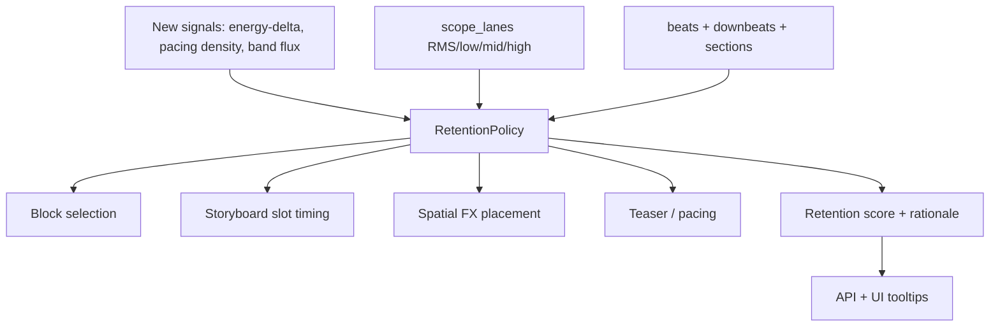

# Viral Editing Decision Engine

## Why (research grounding)

Short-form retention is driven by **pattern interrupts** placed on musical accents, not in gaps:
- Interrupt (zoom/cut/angle/text) roughly **every 3-5s**; too many hurts completion ([pattern-interrupt guide](https://edicionvideopro.com/en/editing-for-platforms-video-marketing/pattern-interrupts-tiktok-retention-guide/), [Inceptly](https://inceptly.com/simple-video-tricks-that-stop-the-scroll/)).
- **Strongest hook in 0-3s**; first zoom/cut should land early on the first real hit.
- **Sync to downbeats/accents**; zoom is the strongest visual interrupt and belongs on **energy peaks / drops**, never in a loudness valley.
- **Energy peaks + scene cuts** are the dominant virality signals in scored-clip data ([AutoClip](https://autoclip.dev/blog/clip-virality-signals-data)); pacing "fast for its own sake" reduces sustained watch time ([Dost & Huang 2026](https://archives.marketing-trends-congress.com/2026/pages/PDF/paper_professor_DOST_HUANG.pdf)).

The current root cause (your zoom-in-a-valley screenshot): FX/drops come from a **track-global onset percentile** (`drop_percentile=0.92` in [beat_detector.py](src/viral_editor/audio/beat_detector.py)) with no reference to the RMS/band energy lanes or downbeats. The engine below fixes that everywhere at once.

## Architecture: one policy, every stage

## Phase 1 - New high-value signals (moderate effort, reuse-friendly)

Extend [beat_detector.py](src/viral_editor/audio/beat_detector.py) `analyze_audio_with_envelope` / `_compute_scope_lanes` and [features.py](src/viral_editor/audio/features.py):
- **Energy-delta (build vs drop)**: first difference of the RMS lane (and low-band) -> a "build" curve (sustained rise) and "drop salience" (rise magnitude into a beat). This becomes the primary drop signal instead of raw onset percentile.
- **Pacing density**: onsets-per-second / transients-per-bar over a sliding window; used to detect "energy peaks" and to govern interrupt cadence.
- **Band-wise spectral flux**: positive flux of high band (snare/hat hits = clean cut points) and low band (kick/bass = rotate), reusing the existing STFT magnitude already computed for `scope_lanes`.
- Persist alongside `scope_lanes.npz` (add arrays) so nothing re-decodes audio; extend `ScopeLaneSeries`/payload in [models.py](src/viral_editor/models.py) and [waveform.py](src/viral_editor/audio/waveform.py).

## Phase 2 - Central RetentionPolicy module

New `src/viral_editor/editing/retention_policy.py` as the single source of truth:
- Research constants: `INTERRUPT_MIN_GAP_S=3.0`, `INTERRUPT_MAX_GAP_S=5.0`, `HOOK_WINDOW_S=3.0`, `EARLY_HOOK_FX_BY_S=2.0`, plus pacing caps.
- Pure functions consumed by all stages:
  - `find_energy_peaks(lanes, downbeats)` -> ranked peak times snapped to nearest downbeat.
  - `classify_accents(transients, energy_delta, band_flux)` -> upgraded `drop`/`bass`/`percussive` using energy-delta + downbeat alignment (fixes zoom-in-valley).
  - `place_interrupts(peaks, downbeats, window)` -> spaced 3-5s, hook-first, capped.
  - `score_plan(...)` -> a 0-1 **retention score** (hook strength + cadence adherence + beat-sync accuracy + energy-peak coverage) used as the optimization target and shown in UI.

## Phase 3 - Retarget each stage to the policy

- **Block selection**: in [loop_planner.py](src/viral_editor/audio/loop_planner.py) (production) and legacy [block_planner.py](src/viral_editor/audio/block_planner.py) `_score_window`, add hook-presence and energy-peak-density terms and prefer windows whose pacing sits in the 3-5s interrupt band.
- **Storyboard slot timing**: in [storyboard.py](src/viral_editor/audio/storyboard.py) `_compute_boundaries`, snap slot boundaries to **downbeats nearest energy peaks**, enforce the interrupt cadence, and guarantee a hook slot with an early accent.
- **Spatial FX**: rewrite [spatial_fx.py](src/viral_editor/video/spatial_fx.py) `plan_spatial_fx` to emit zoom on policy energy-peak+downbeat events (not onset percentile), rotate on low-band flux; keep merge/per-second cap. Mirror in [spatialFxMarkers.ts](web/src/utils/spatialFxMarkers.ts) so UI overlays match.
- **Teaser / pacing**: in [teaser.py](src/viral_editor/video/teaser.py), pick payoff on the highest drop-salience downbeat; align `payoff_downbeats_s` to the policy.

## Phase 4 - Rationale + config surface

- Add `reason`/`rationale` to `FxEvent` and `StorySlot` in [models.py](src/viral_editor/models.py) (e.g. "RMS peak @1.62s on downbeat") and expose via [schemas.py](src/viral_editor/api/schemas.py) so the UI shows **why** each marker exists (addresses the earlier "why is zoom here" confusion).
- Add a `RetentionConfig` (interrupt cadence, hook policy, pacing cap) to [config.py](src/viral_editor/config.py); thread through the effects PATCH path.
- Show the **retention score** in the storyboard/FX panel as the headline "viral-readiness" metric.

## Phase 5 - Tests + validation

- Use `fixtures/audio/validation_drop.wav`, `validation_bass.wav`, `validation_clicks.wav` to assert: zoom lands within tolerance of an RMS/band energy peak AND a downbeat; **no zoom in an RMS valley**; interrupt spacing within 3-5s; hook has an FX by ~2s; rotate maps to low-band hits.
- Extend `tests/test_beat_detector.py`, `tests/test_waveform_lanes.py`, `tests/test_storyboard.py`; add `tests/test_retention_policy.py` and `tests/test_spatial_fx.py`.
- Keep frontend `npm run build` green; add a small unit test for the mirrored marker logic.

## Notes / decisions
- Old jobs lack the new arrays in `scope_lanes.npz`; plan includes a graceful fallback (policy degrades to current behavior when new signals are absent) and a re-analyze path.
- Render integration stays as-is (preview composite in [proxy_render.py](src/viral_editor/video/proxy_render.py)); this plan changes **what** gets placed, not the FFmpeg graph.