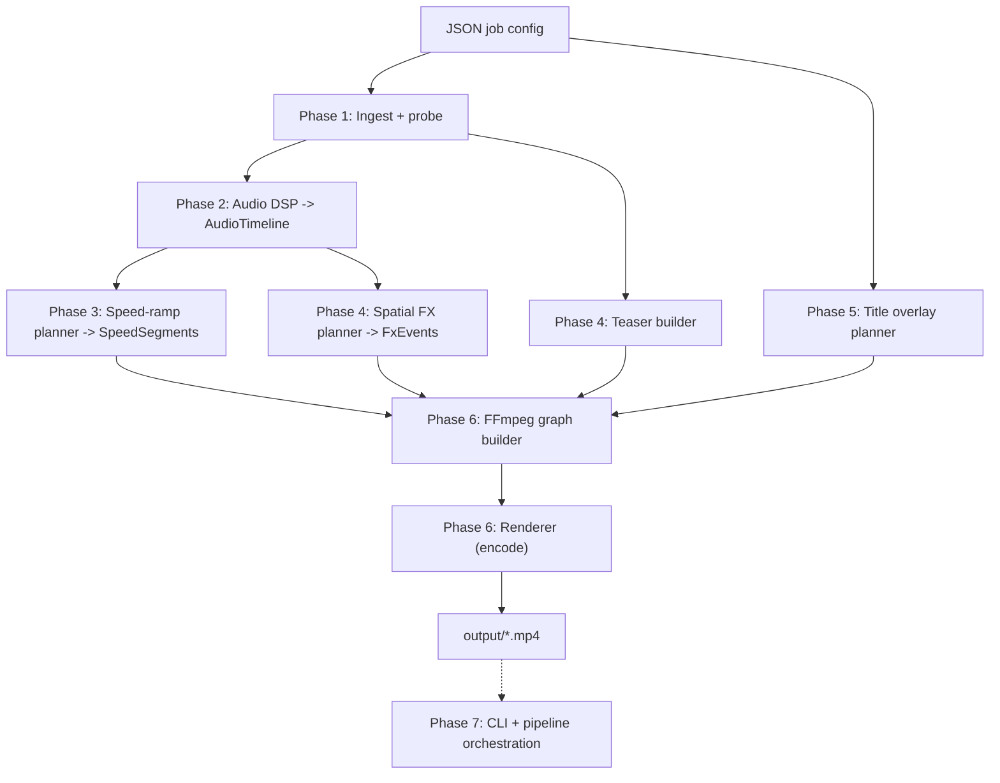

# Automated Retention Video Editor - Phased Implementation Plans

This folder breaks the high-level [automated_retention_video_editor_plan.md](../automated_retention_video_editor_plan.md) into detailed, independently actionable phase plans for the **local-first core loop**.

## Locked decisions

- **Language / orchestration:** Python
- **Rendering engine:** FFmpeg `filter_complex` (Python orchestrates)
- **Interface:** CLI (structured so a thin API can wrap it later)
- **Env / deps:** `venv` + `requirements.txt`
- **Output spec:** `1080x1920`, H.264 + AAC, `60 fps`, `.mp4`
- **Audio source:** a separate music track file supplied with the timelapse
- **Sample assets:** provided by the user
- **FFmpeg:** install/verify is part of setup

## Guiding architectural principles

- **Pure, side-effect-free planners.** Audio, speed-ramp, FX, teaser, and title logic produce serializable domain models (`models.py`) and never touch FFmpeg directly. This makes them unit-testable without media I/O.
- **Single FFmpeg boundary.** All `ffmpeg`/`ffprobe` calls go through `utils/ffmpeg.py` for logging, error capture, and future replacement.
- **Stage contracts via typed models.** Each phase consumes and emits typed, JSON-serializable artifacts written to `temp/` for inspection. Moving to async workers/cloud later becomes a transport change, not a rewrite.
- **Fail fast, log loud.** Validate inputs and environment before doing expensive work; structured logging at each stage boundary.
- **Determinism.** A `seed` in the job config makes any randomized styling reproducible.

## Pipeline overview

## Phase index

| Phase | Plan | Status |
| :--- | :--- | :--- |
| 0 | [phase-0-scaffolding.md](phase-0-scaffolding.md) | Core |
| 1 | [phase-1-config-ingestion.md](phase-1-config-ingestion.md) | Core |
| 2 | [phase-2-audio-dsp.md](phase-2-audio-dsp.md) | Core |
| 3 | [phase-3-speed-ramp.md](phase-3-speed-ramp.md) | Core (hardest) |
| 4 | [phase-4-teaser-spatial-fx.md](phase-4-teaser-spatial-fx.md) | Core |
| 5 | [phase-5-title-overlay.md](phase-5-title-overlay.md) | Core |
| 6 | [phase-6-render.md](phase-6-render.md) | Core |
| 7 | [phase-7-cli-e2e.md](phase-7-cli-e2e.md) | Core |
| 8 | [phase-8-retention-engine.md](phase-8-retention-engine.md) | Deferred |
| 9 | [phase-9-cloud-web.md](phase-9-cloud-web.md) | Deferred |

## Shared domain models (the contract between phases)

Defined once in `src/viral_editor/models.py` and reused everywhere:

- `MediaInfo` - probed metadata (duration, fps, resolution, codecs, has_audio).
- `Transient` - `{ timestamp_ms, amplitude_normalized, type }` where `type in {percussive, bass, drop}`.
- `AudioTimeline` - `{ global_bpm, audio_duration_seconds, sample_rate, transients[] }`.
- `SpeedSegment` - `{ out_start_s, out_end_s, src_start_s, src_end_s, speed_factor }`.
- `FxEvent` - `{ timestamp_s, kind, magnitude, decay_frames }`.
- `TeaserSpec` - `{ src_start_s, src_end_s, out_duration_s, mask }`.
- `TitleSpec` - `{ lines[], font, size_px, fill, emphasis, box, window_s }`.
- `RenderPlan` - aggregate handed to the FFmpeg builder.

Every model is a `pydantic` model (or `@dataclass` with a `to_dict`) so it serializes cleanly to `temp/*.json`.
