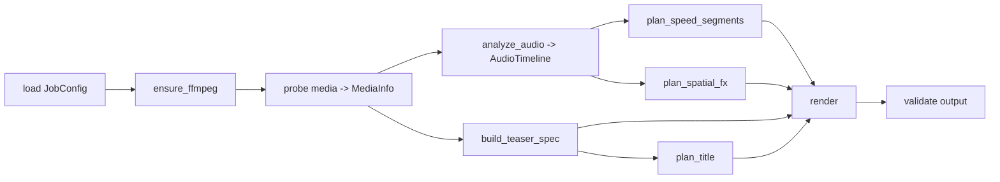

# Phase 7 - CLI & End-to-End Pipeline Orchestration

**Goal:** Wire all stages into one command that takes a job config and produces the final video, with structured logging, inspectable per-stage artifacts, and validation on real sample assets.

**Status:** Core. Depends on Phases [0](phase-0-scaffolding.md)-[6](phase-6-render.md).

---

## Objective

Deliver the runnable product: `python -m viral_editor run config/job.json`. This phase contains no new video logic - it composes the pure planners and the renderer into a single orchestrated, observable flow and proves it end-to-end.

## Files & responsibilities

### `pipeline.py`
A single `run_pipeline(config_path, *, keep_temp, verbose) -> Path` that executes stages in order and persists artifacts:

Responsibilities:
- Orchestrate the call order; pass typed models between stages (no globals).
- Write each artifact to `temp/`: `media_info.json`, `audio_timeline.json`, `speed_segments.json`, `fx_events.json`, `teaser_spec.json`, `title_spec.json`.
- Wrap each stage with `log_stage(...)` timing and clear start/finish lines.
- On failure, surface the failing stage + actionable message; leave `temp/` for inspection.
- Clean `temp/` at the end unless `--keep-temp`.

### `cli.py`
- `run` command: `<config.json>`, `--verbose`, `--keep-temp`, optional `--only <stage>` / `--from <stage>` for partial re-runs during development (re-use cached `temp/` artifacts).
- Friendly top-level error handling: catch domain errors (`IngestError`, `FFmpegError`, validation errors) and print concise guidance; full traceback only with `--verbose`.
- Exit codes: `0` success, non-zero on failure (CI-friendly).

## Design notes

- **Resumability:** `--from`/`--only` read existing `temp/*.json` so devs can iterate on, say, rendering without re-running DSP. Cheap and high-value for a heavy pipeline.
- **Single timeline authority** enforced here: derive `output_duration_s` once and pass it down.
- **Progress visibility:** `rich` progress/log per stage; render stage streams FFmpeg progress.

## Dependencies

- All prior phases and their pure functions / renderer.

## Testing

- **End-to-end smoke test:** run on a short bundled fixture (a few-second clip + short track); assert an MP4 is produced at the locked spec and all `temp/*.json` exist.
- **CLI tests:** invalid config path -> clear error + non-zero exit; `--keep-temp` retains artifacts; `--from render` reuses cached artifacts.
- **Golden artifacts (optional):** snapshot `speed_segments.json`/`fx_events.json` for a fixed fixture + seed to catch regressions.

## Acceptance criteria

- `python -m viral_editor run config/job.json` on the user's sample assets produces a correct `output/result.mp4`.
- All stage artifacts are written and inspectable.
- Failures report the responsible stage; partial re-runs work.
- `pytest` green including the e2e smoke test.

## Risks & mitigations

- **Long total runtime obscuring failures:** per-stage timing + early validation (Phase 1) fail before expensive render.
- **Hidden coupling between stages:** enforce that stages only communicate via typed models / `temp` artifacts (no shared mutable state), which is what makes the future cloud move ([Phase 9](phase-9-cloud-web.md)) a transport swap.

## Definition of done for the local core loop

After this phase, the project satisfies the user's "core loop and functionality" goal: ingest -> beat detection -> speed-ramp -> teaser -> spatial FX -> title -> render, runnable locally via one CLI command on real assets.
