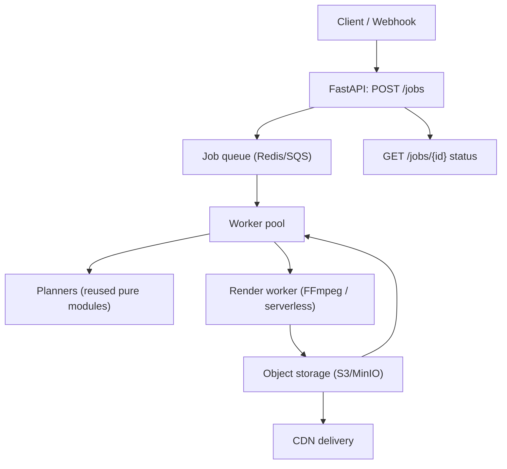

# Phase 9 - Cloud / Web Migration (Deferred)

**Goal:** Wrap the proven local pipeline in an async API and move heavy rendering to scalable infrastructure - without rewriting the core logic.

**Status:** Deferred. Depends on a stable core loop ([Phases 0-7](README.md)).

---

## Objective

Promote the CLI tool to a service. Because every stage already communicates via typed, serializable models and a single FFmpeg boundary, this phase is largely a **transport + infrastructure** change rather than a logic rewrite - the central design payoff of the local-first architecture.

## Target architecture

## Work items

### 9.1 API layer
- `api/main.py` (FastAPI): `POST /jobs` accepts the same `JobConfig` JSON (now with asset URLs instead of local paths), returns a job id; `GET /jobs/{id}` returns status + output URL.
- Reuse `JobConfig` directly; add a URL-vs-path resolver in ingestion.

### 9.2 Asynchronous orchestration
- Introduce a queue (Redis + RQ/Celery, or cloud-native SQS) and stateless workers that call the existing `run_pipeline` (refactored to accept resolved local temp paths after download).
- Job state store (Postgres/Supabase or Redis) for status, errors, output location.

### 9.3 Storage & I/O abstraction
- `storage/` adapter interface (`get(uri)`, `put(local, uri)`) with `local` and `s3`/`minio` implementations. Ingestion/render call the adapter instead of touching the filesystem directly.

### 9.4 Scalable rendering
- Option A: containerized FFmpeg workers (Docker) autoscaled by queue depth - reuses Phase 6 as-is.
- Option B: serverless render (AWS Lambda with FFmpeg layer) for burst parallelism; or Remotion if a richer animation engine is later desired (revisits the [original render decision](../automated_retention_video_editor_plan.md)).
- Parallelize per-segment extraction across workers (the segment model already supports independent units).

### 9.5 Delivery & ops
- CDN (CloudFront) in front of the output bucket.
- Observability: structured logs shipped centrally, per-stage metrics, job tracing.
- Auth on the API; rate limiting; signed asset URLs.

## Refactors enabled by good local design

- `run_pipeline` already takes typed inputs and writes discrete artifacts -> wrap in a worker task.
- Single FFmpeg boundary -> swap local binary for a containerized/serverless executor behind the same interface.
- Pure planners -> run anywhere, no I/O coupling.

## Testing

- Contract tests for the storage adapter (local vs s3 parity).
- API integration tests (submit job -> poll -> output URL).
- Load test worker autoscaling on queue depth.

## Acceptance criteria

- Submitting a job via `POST /jobs` with asset URLs produces the same output as the local CLI for the same inputs.
- Workers scale horizontally; no core video logic duplicated from the local phase.

## Risks & mitigations

- **FFmpeg in serverless (size/time limits):** prefer container workers first; serverless only for short segments.
- **Cost of always-on infra:** scale-to-zero workers; queue-driven.
- **Divergence between local and cloud code paths:** keep `run_pipeline` and planners as the single shared implementation; cloud only adds transport/storage around them.
