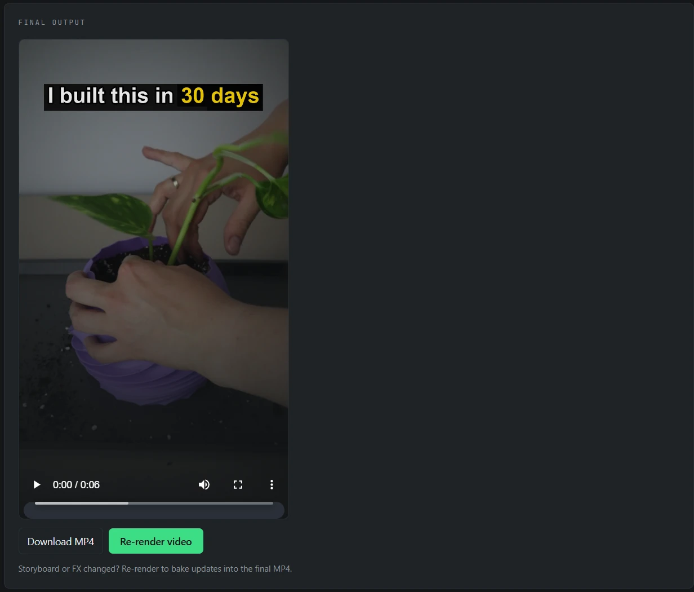
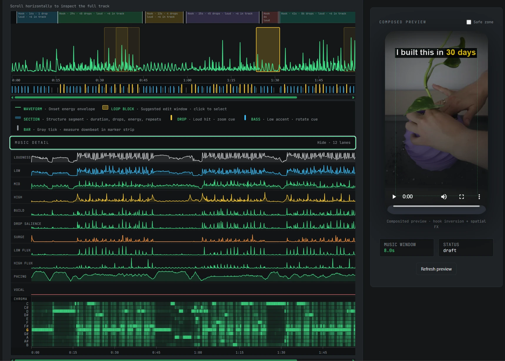
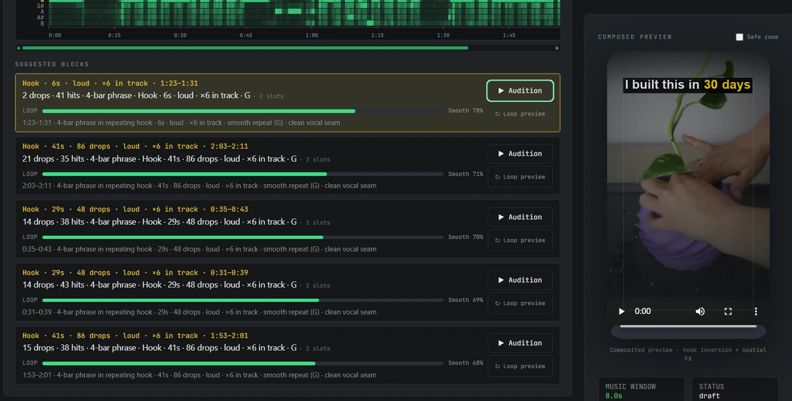
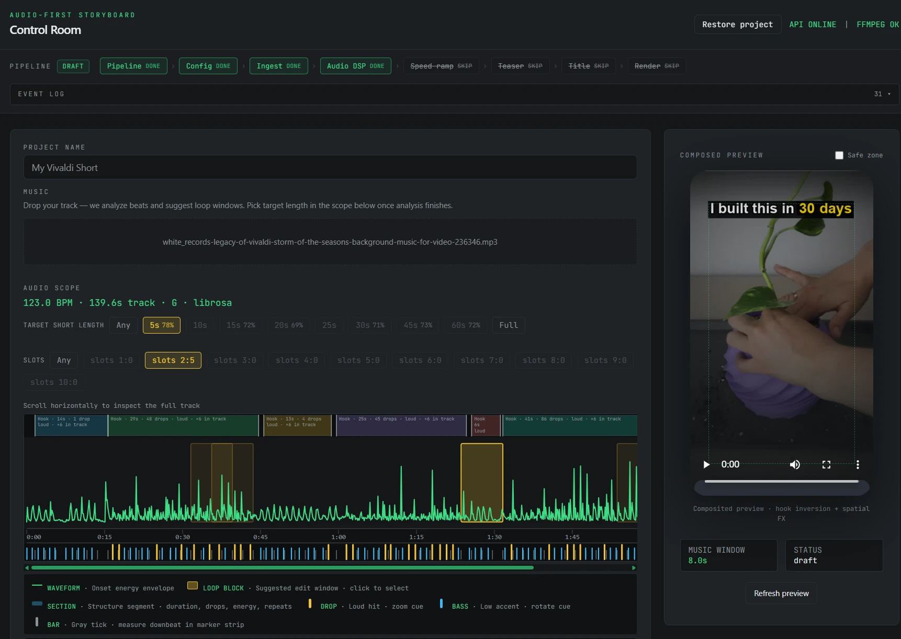
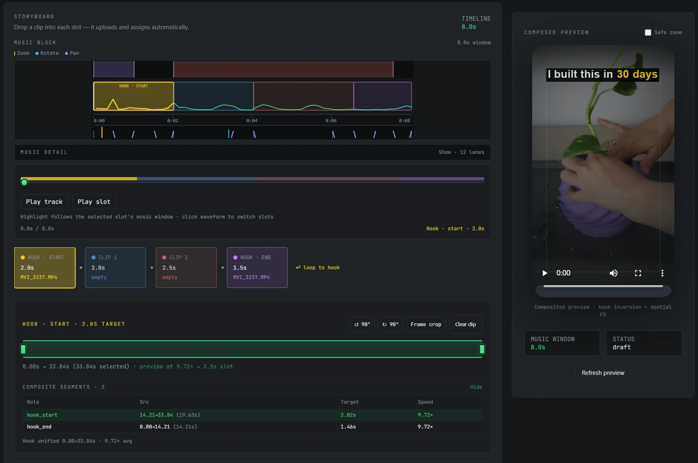
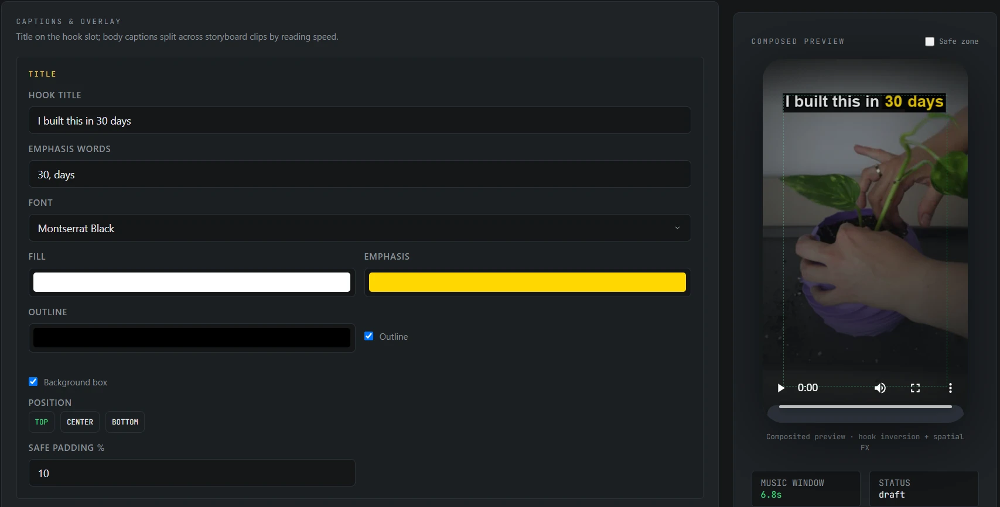
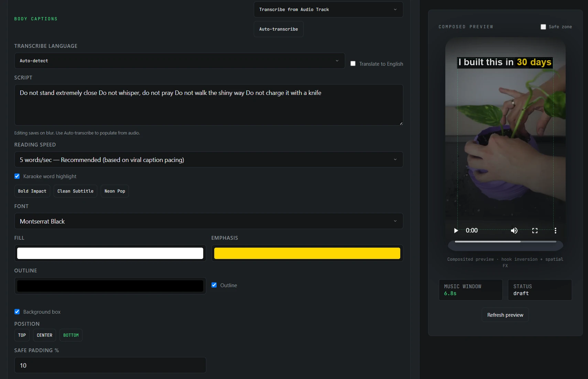
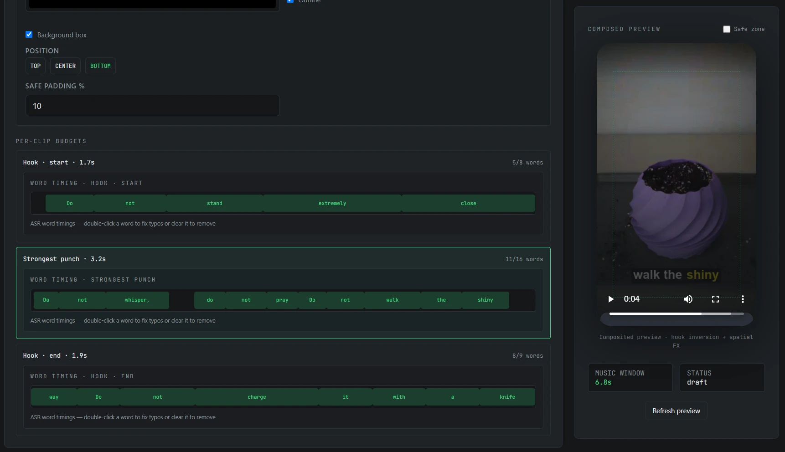
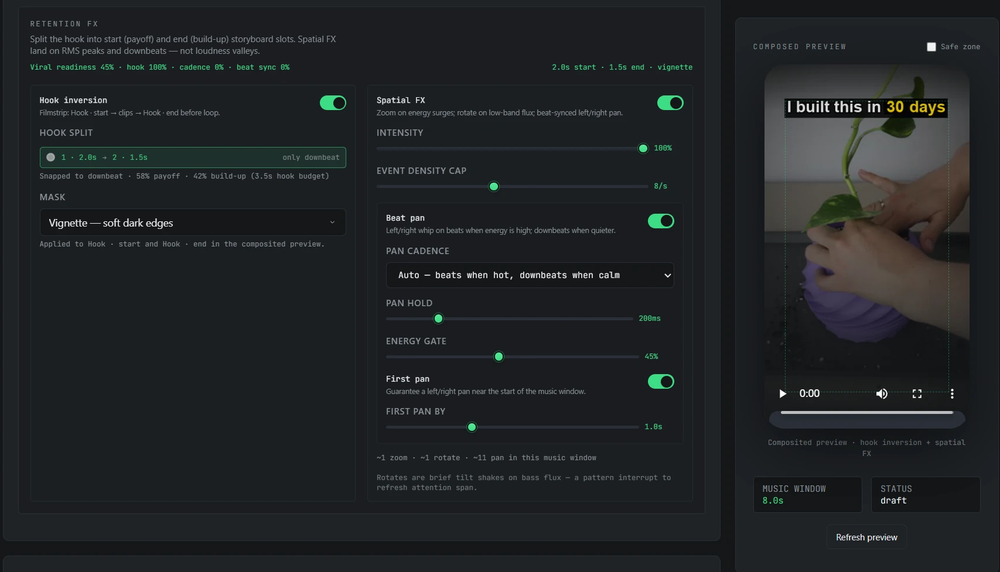

# Viral Editor

Turn raw footage and a music track into a high-retention vertical short — timed to the beat, hooked in the first seconds, ready for Shorts, Reels, and TikTok.



## The problem

Short-form platforms reward videos that open with a clear hook, move with the music, and land before attention drifts. Doing that by hand means scrubbing waveforms, guessing loop points, speed-ramping clips into awkward windows, and re-styling titles for every cut.

Most of that work is repetitive. Little of it needs to be reinvented for every upload.

## What it is

**Viral Editor** is a local-first Control Room for audio-first short composition. You bring the clips and the track. The app finds the musical structure, proposes loopable windows, fits footage into timed slots, and renders a `1080×1920` MP4 (H.264 + AAC, 60 fps) with FFmpeg on your machine.

Nothing leaves your workstation unless you choose to publish the output.

## How a short gets made

### 1. Read the music

Upload a track. The Control Room maps energy, drops, bass hits, and harmonic structure so edits follow the song — not a fixed template.



### 2. Pick a loop that holds

Suggested blocks score hooks by length, loudness, drop density, and loop smoothness. Audition candidates and lock the window that carries the short.



### 3. Set the target length

Choose a short duration and the slots that fill it. The music window becomes the timeline every clip must fit.



### 4. Drop clips into the storyboard

Assign footage to hook and body slots. The storyboard speed-fits each clip into its music window and shows a composed vertical preview as you work.



### 5. Write the hook title

Set the on-screen line, emphasize the words that should pop, and keep safe padding clear of platform UI chrome.



### 6. Add captions

Configure caption style and auto-transcribe when you want spoken lines locked to the picture. Preview how captions sit on the frame before you render.

This is not plain transcription of the mixed track. A vocal-separation model (Demucs) first pulls the singing/spoken voice out of the music; the speech model then reads that clean vocal track — so captions land with pinpoint timing and stay reliable even when the beat is loud.





### 7. Layer beat-synced SFX

Place impact sounds on the moments the music already marked — drops, hits, and accents — so audio and picture land together.



### 8. Download the MP4

Bake the storyboard into a final vertical file. Re-render when clips, titles, or FX change.


## Why this approach

- **Audio first** — structure comes from the track; video follows.
- **Visible planning** — energy lanes, loop scores, and slot windows make edit decisions inspectable before encode.
- **Live composed preview** — see the vertical frame (hook inversion, spatial FX, titles) while you still adjust slots.
- **Local render** — FFmpeg encodes on your machine for privacy, repeatability, and full control of the output file.

---

## Technical

### Requirements

- **Python 3.11+** (best librosa/numba wheel support on Windows)
- **FFmpeg 6.x** on `PATH` (`ffmpeg` and `ffprobe`)

### Setup (Windows)

Use a **project virtualenv** — do not install into system Python, or scripts may fail to land on PATH.

```powershell
python -m venv .venv
.venv\Scripts\Activate.ps1
pip install -e ".[ui,dev]"
```

After activation:

```powershell
python -m viral_editor serve    # always works
viral-editor serve              # same, if Scripts is on PATH
```

Install FFmpeg if missing:

```powershell
winget install Gyan.FFmpeg
# or: choco install ffmpeg
ffmpeg -version
ffprobe -version
```

Place sample media under `assets/` (see `assets/README.md`). Job configs live in `config/`.

### Control Room UI

Local web dashboard for configuring jobs, watching pipeline telemetry, and previewing output.

#### Development (one terminal)

```powershell
# API + Vite hot reload (with venv activated)
cd web && npm install && cd ..
python -m viral_editor dev
```

Open http://localhost:5173 (Vite proxies `/api` to the API on port 8765).

To run API and UI separately: `python -m viral_editor serve` and `cd web && npm run dev`.

#### Production-style (single server)

```powershell
cd web && npm install && npm run build
cd ..
python -m viral_editor serve
```

Open http://127.0.0.1:8765 — serves the built UI from `web/dist/`.

#### Docker (recommended for beat-this neural tracking)

The container includes FFmpeg, PyTorch (CPU), and the `beat-this` downbeat tracker. Model weights cache in a named volume after first run.

```powershell
docker compose up --build
```

Open http://127.0.0.1:8765. Bind-mounts:

- `./input` — drop source files
- `./output` — rendered results
- `./temp` — job workspaces (optional inspection)

**Demucs vocal separation:** loop planning uses the `htdemucs` model (via `demucs` + `torch`, installed by default). Weights download on first analysis and cache under `TORCH_HOME` (default `~/.cache/torch`). Set `DEMUCS_MODEL_CACHE` to pin the cache directory (e.g. a Docker volume).

**GPU (recommended for Demucs):** the default `pip install` pulls a **CPU-only** PyTorch wheel (`+cpu`). `pip install --upgrade … --index-url cu124` alone will **not** replace it — pip sees `torch` as already satisfied. Uninstall first, then install CUDA wheels:

```powershell
.venv\Scripts\Activate.ps1
pip uninstall torch torchaudio -y
pip install torch torchaudio --index-url https://download.pytorch.org/whl/cu124
python -c "import torch; print(torch.__version__, torch.cuda.is_available(), torch.cuda.get_device_name(0) if torch.cuda.is_available() else 'no gpu')"
```

You should see a `+cu124` version and `True`. Demucs then auto-selects your NVIDIA GPU (`DEMUCS_DEVICE=auto`). Progress will show `GPU · <your card name>`. Force CPU with `DEMUCS_DEVICE=cpu`.

CPU tuning: default **8 parallel chunk jobs** (`DEMUCS_NUM_WORKERS`), `shifts=0`, `overlap=0.15`. Vocal stems cache under `temp/vocal_stem_demucs.npz` per job and globally under `%TORCH_HOME%/vocal_stems/` (content hash). Set `VIRAL_VOCAL_STEM_CACHE` to override the global folder.

For neural beat tracking locally (optional extra):

```powershell
pip install -e ".[ui,dev,audio-nn]" --extra-index-url https://download.pytorch.org/whl/cpu
```

### Usage (CLI)

```powershell
python -m viral_editor run config/job.example.json
python -m viral_editor run config/job.example.json --verbose
```

Pipeline stages load the job JSON, probe media, run beat/downbeat tracking and MIR features, plan speed ramps / FX / titles, and encode through FFmpeg. Architecture and phase plans: [documentation/plans/README.md](documentation/plans/README.md).

### Project layout

```
src/viral_editor/     # application package
  cli.py              # Typer entrypoint
  models.py           # shared domain models (stage contracts)
  pipeline.py         # orchestrator
  utils/ffmpeg.py     # FFmpeg/ffprobe wrapper
  utils/logging.py    # structured logging
config/               # job JSON files
assets/               # input media (gitignored)
documentation/images/ # README screenshots
output/               # rendered MP4s (gitignored)
temp/                 # per-stage JSON artifacts (gitignored)
tests/
web/                  # Control Room UI
```

### Shared domain models

Defined in `viral_editor.models` and serialized to `temp/*.json` between stages:

| Model | Purpose |
| :--- | :--- |
| `MediaInfo` | Probed stream metadata (duration, fps, resolution, codecs) |
| `Transient` | Audio hit at `{timestamp_ms, amplitude_normalized, type}` |
| `AudioTimeline` | BPM, duration, sample rate, and transient list |
| `SpeedSegment` | Output/source time window with constant speed factor |
| `FxEvent` | Zoom or rotation impulse keyed to a timestamp |
| `TeaserSpec` | Tail-clip teaser window and mask style |
| `TitleSpec` | Hook text layout, colors, and overlay window |
| `RenderPlan` | Aggregate plan handed to the FFmpeg builder |

### Development

```powershell
pytest
```

#### Auto-rotation on upload

Clip uploads run a 3-step detector (container metadata → aspect ratio → orientation classifier) and set `rotation_deg`. When the classifier returns a vote, it wins; metadata and aspect are fallbacks if it abstains. Manual 90° rotate buttons in the storyboard still override detection.

The keyframe step uses [DuarteBarbosa/deep-image-orientation-detection](https://huggingface.co/DuarteBarbosa/deep-image-orientation-detection) (EfficientNet ONNX).

| Variable | Default | Purpose |
|----------|---------|---------|
| `AUTO_ROTATE_ENABLED` | `true` | Master switch |
| `AUTO_ROTATE_ORIENTATION_ENABLED` | `true` | Enable/disable the classifier step only |
| `ORIENTATION_MODEL_REPO` | `DuarteBarbosa/deep-image-orientation-detection` | Hugging Face model repo |
| `ORIENTATION_MODEL_FILE` | `orientation_model_v2_0.9882.onnx` | ONNX weights filename in the repo |
| `AUTO_ROTATE_KEYFRAME_COUNT` | `3` | Keyframes analyzed per clip |
| `AUTO_ROTATE_MIN_ORIENTATION_CONFIDENCE` | `0.55` | Minimum softmax confidence to accept a classifier vote |

Per-clip decision logs are written to `temp/rotation_log/<clip_id>.json` inside each job workspace.
