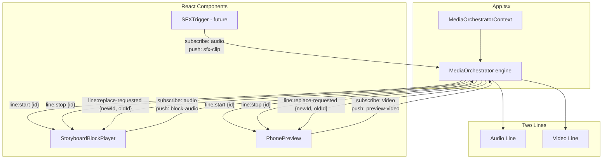
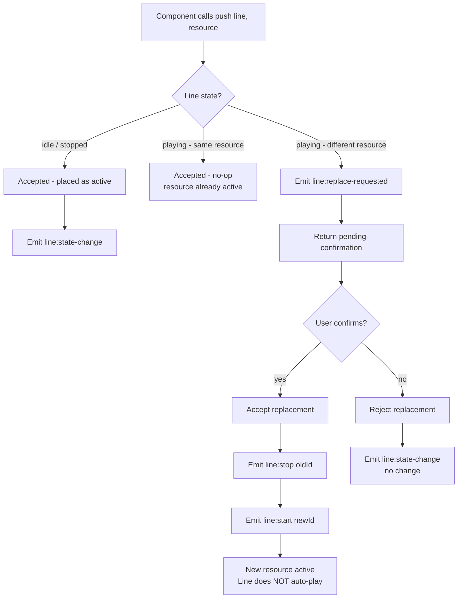
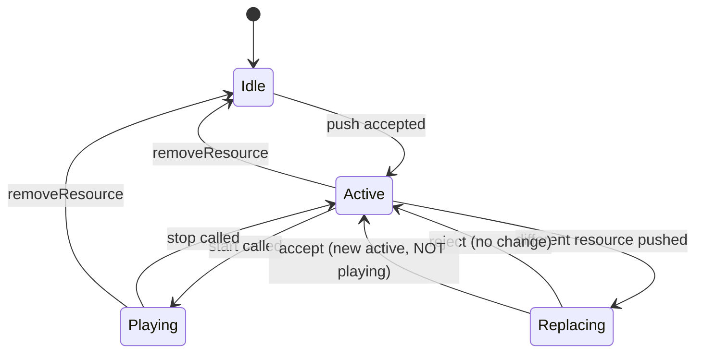

# Media Orchestrator Architecture Plan (Revised)

## Overview

Introduce a `MediaOrchestrator` with exactly **two lines**: `audio` and `video`. Each line is a queue that holds one active resource at a time. Components subscribe to their relevant line(s), receive events (`line:start`, `line:stop`, `line:replace-requested`), and derive button states from the subscription data. No component directly controls playback -- they only push resources into lines and react to events.

## Current State Analysis

```
[App.tsx]
  |
  +-- [StoryboardBlockPlayer] -- controls <audio> directly
  |     - audio.play() / audio.pause()
  |     - audio.currentTime = X
  |     - loop mode: slot / block
  |
  +-- [PhonePreview] ------------ controls <video> directly
        - video.play() / video.pause()
        - video.currentTime = X
        - compositeMode transport
```

**Problem**: Playback is scattered. No central authority. Components have no knowledge of what other components are playing.

## Target State

```
[App.tsx]
  |
  +-- [MediaOrchestratorContext] -- React context provider
        |
        +-- [MediaOrchestrator engine]
              |
              +-- Line: audio (queue of 1)
              +-- Line: video (queue of 1)
              |
              +-- Events: line:start, line:stop, line:replace-requested
              |
              +-- [StoryboardBlockPlayer] -- subscribe(audio), push(block-audio)
              +-- [PhonePreview] ------------ subscribe(video), push(preview-video)
              +-- [FutureSFXTrigger] -------- subscribe(audio), push(sfx-clip)
```

## Architecture Diagram



## Core Types

### Line Types

```typescript
export type MediaLine = "audio" | "video";

export interface MediaLineState {
  /** Current active resource on this line, or null if idle */
  active: MediaResource | null;
  /** Whether the line is currently playing */
  playing: boolean;
  /** Queue of pending resources (max 1 for simplicity) */
  queue: MediaResource[];
}
```

### Resource Descriptor

```typescript
export interface MediaResource {
  /** Unique ID for this resource instance */
  id: string;
  /** Which line this belongs to */
  line: MediaLine;
  /** Source URL */
  src: string;
  /** Duration in seconds (0 = unknown) */
  duration: number;
  /** Optional metadata for debugging / UI */
  metadata?: Record<string, unknown>;
}
```

### Events

```typescript
export type MediaEvent =
  | { type: "line:start"; line: MediaLine; resourceId: string }
  | { type: "line:stop"; line: MediaLine; resourceId: string }
  | { type: "line:replace-requested"; line: MediaLine; newResource: MediaResource; oldResource: MediaResource }
  | { type: "line:state-change"; line: MediaLine; state: MediaLineState };

export type MediaEventListener = (event: MediaEvent) => void;
```

### Orchestrator API

```typescript
class MediaOrchestrator {
  /** Push a resource into a line. Returns decision. */
  push(line: MediaLine, resource: MediaResource): PushDecision;

  /** Start playback on a line (no auto-start on push) */
  start(line: MediaLine): void;

  /** Stop playback on a line */
  stop(line: MediaLine): void;

  /** Accept a replacement (called after user confirms popup) */
  acceptReplacement(line: MediaLine, newResource: MediaResource): void;

  /** Reject a replacement */
  rejectReplacement(line: MediaLine): void;

  /** Subscribe to events for a specific line */
  subscribe(line: MediaLine, listener: MediaEventListener): () => void;

  /** Subscribe to all lines */
  subscribeAll(listener: MediaEventListener): () => void;

  /** Get current state of a line */
  getLineState(line: MediaLine): MediaLineState;

  /** Get state of all lines */
  getAllStates(): Record<MediaLine, MediaLineState>;

  /** Remove a resource from a line (cleanup) */
  removeResource(line: MediaLine, resourceId: string): void;
}
```

### Push Decision

```typescript
export type PushDecision =
  | { kind: "accepted"; message: string }
  | { kind: "rejected"; reason: string }
  | { kind: "pending-confirmation"; newResource: MediaResource; oldResource: MediaResource };
```

## Conflict Resolution Logic

### Push Decision Flow



### Rules Summary

| Line State | Push Action | Result |
|---|---|---|
| idle (no active) | push | Accepted, becomes active, NOT playing until start() called |
| stopped (active exists but paused) | push same id | Accepted, no-op |
| stopped (active exists but paused) | push different id | Pending confirmation popup |
| playing | push same id | Accepted, no-op |
| playing | push different id | Pending confirmation popup |

### Key Behaviors

1. **No auto-play**: Pushing a resource into a line does NOT start playback. Components must call `start(line)` explicitly.
2. **Replace does not auto-play**: When user confirms replacement, the old resource stops (`line:stop`), new becomes active (`line:start`), but playback does NOT resume automatically.
3. **One at a time per line**: Each line holds exactly one active resource. Queue is for pending replacements.
4. **Event-driven UI**: Components derive button labels from subscription data, not internal state.

## Component Button State Logic

### PhonePreview (Video Line)

```typescript
function PhonePreview() {
  const orchestrator = useMediaOrchestrator();
  const videoState = useMediaLine("video");
  
  // Button label derived from line state
  const buttonLabel = videoState.playing ? "Pause" : "Play";
  const buttonDisabled = !videoState.active && !videoPreviewUrl;
  
  const handleClick = () => {
    if (videoState.playing) {
      orchestrator.stop("video");
    } else if (videoState.active) {
      orchestrator.start("video");
    } else if (videoPreviewUrl) {
      // No active resource, push first
      const decision = orchestrator.push("video", {
        id: "preview-video",
        line: "video",
        src: videoPreviewUrl,
        duration: 0,
      });
      if (decision.kind === "accepted") {
        orchestrator.start("video");
      }
    }
  };
}
```

### StoryboardBlockPlayer (Audio Line)

```typescript
function StoryboardBlockPlayer() {
  const orchestrator = useMediaOrchestrator();
  const audioState = useMediaLine("audio");
  
  // Button label derived from line state
  // When audio line is idle: "Put in audio line"
  // When audio line has active resource: "Play" / "Pause" based on playing
  const buttonLabel = audioState.playing 
    ? "Pause" 
    : audioState.active 
      ? "Play" 
      : "Put in audio line";
  
  const handleClick = () => {
    if (audioState.active) {
      // Toggle play/pause
      if (audioState.playing) {
        orchestrator.stop("audio");
      } else {
        orchestrator.start("audio");
      }
    } else {
      // Push block audio to line
      const decision = orchestrator.push("audio", {
        id: "block-audio",
        line: "audio",
        src: audioUrl,
        duration: storyboard.total_duration_s,
      });
      if (decision.kind === "accepted") {
        orchestrator.start("audio");
      } else if (decision.kind === "pending-confirmation") {
        // Show confirmation popup
        setShowReplaceDialog(true);
      }
    }
  };
}
```

### StoryboardPanel - Clip Assignment Flow

```typescript
// When a clip is assigned to a slot:
const handleAssignClip = async (slotId, file, cropStartS, cropEndS) => {
  // ... assign to backend ...
  
  // After backend responds with new storyboard:
  // Push composed preview to video line
  const decision = orchestrator.push("video", {
    id: "composed-preview",
    line: "video",
    src: compositePreviewUrl,
    duration: storyboard.total_duration_s,
  });
  
  if (decision.kind === "pending-confirmation") {
    // Show popup: "Replace current preview with new composition?"
    setShowReplaceDialog(true);
  }
};
```

## React Integration

### Context Provider

```typescript
const MediaOrchestratorContext = createContext<MediaOrchestrator | null>(null);

function MediaOrchestratorProvider({ children }: { children: ReactNode }) {
  const orchestratorRef = useRef(new MediaOrchestrator());
  
  // Singleton - created once on mount
  if (!orchestratorRef.current) {
    orchestratorRef.current = new MediaOrchestrator();
  }
  
  return (
    <MediaOrchestratorContext value={orchestratorRef.current}>
      {children}
    </MediaOrchestratorContext>
  );
}

function useMediaOrchestrator(): MediaOrchestrator {
  const ctx = useContext(MediaOrchestratorContext);
  if (!ctx) throw new Error("Must be within MediaOrchestratorProvider");
  return ctx;
}
```

### Line Subscription Hook

```typescript
function useMediaLine(line: MediaLine): MediaLineState {
  const [state, setState] = useState<MediaLineState>(() => {
    // Initial state from orchestrator
    return useMediaOrchestrator().getLineState(line);
  });
  
  const orchestrator = useMediaOrchestrator();
  
  useEffect(() => {
    const listener = (event: MediaEvent) => {
      if (event.type === "line:state-change" && event.line === line) {
        setState(event.state);
      }
    };
    orchestrator.subscribe(line, listener);
    return () => orchestrator.unsubscribe(line, listener);
  }, [orchestrator, line]);
  
  return state;
}

function useMediaLineEvent(
  line: MediaLine, 
  eventType: MediaEvent["type"], 
  handler: (event: Extract<MediaEvent, { type: typeof eventType }>) => void
) {
  const orchestrator = useMediaOrchestrator();
  
  useEffect(() => {
    const listener = (event: MediaEvent) => {
      if (event.type === eventType && event.line === line) {
        handler(event as any);
      }
    };
    orchestrator.subscribe(line, listener);
    return () => orchestrator.unsubscribe(line, listener);
  }, [orchestrator, line, eventType, handler]);
}
```

### Conflict Confirmation Popup Component

```typescript
function ReplaceConfirmationDialog({
  line,
  newResource,
  oldResource,
  onConfirm,
  onReject,
}: {
  line: MediaLine;
  newResource: MediaResource;
  oldResource: MediaResource;
  onConfirm: () => void;
  onReject: () => void;
}) {
  return (
    <ConfirmDialog
      title={`Replace ${line} track?`}
      message={`Current: ${oldResource.metadata?.label ?? oldResource.id}`}
      confirmLabel="Replace"
      cancelLabel="Keep current"
      onConfirm={onConfirm}
      onCancel={onReject}
    />
  );
}
```

## Sticky Bottom Media Bar Component

A new component `MediaBar` is added as a sticky footer showing both lines transport controls side by side.

### Component Layout

```
+-------------------------------------------------------------------+
| AUDIO  Block Audio Preview    [PLAY]   0:00 ----*---- 0:30       |
+-------------------------------------------------------------------+
| VIDEO  Phone Preview            [PLAY]   0:00 --*--- 1:24        |
+-------------------------------------------------------------------+
```

### Props Interface

```typescript
interface MediaBarProps {
  audioLabel?: string;  // Override label for audio line
  videoLabel?: string;  // Override label for video line
}
```

### Per-Row Structure

Each row has: `[label] [PLAY/PAUSE button] [scrubber with time markers]`

**Button states derived from line subscription:**
| Line State | Button Label |
|---|---|
| Idle (no active resource) | "PUT IN LINE" (disabled) |
| Active, not playing | "PLAY" |
| Playing | "PAUSE" |

**Scrubber behavior:**
- Visual position updates during drag (no seek)
- Seek fires only on pointer up
- Range clamped to `[0, resource.duration]`
- `*` marker shows current scrub position

### Implementation Sketch

```typescript
function MediaBar({ audioLabel: propAudioLabel, videoLabel: propVideoLabel }: MediaBarProps) {
  const orchestrator = useMediaOrchestrator();
  const audioState = useMediaLine("audio");
  const videoState = useMediaLine("video");
  
  // Scrubber drag state per line
  const [audioScrubbing, setAudioScrubbing] = useState(false);
  const [videoScrubbing, setVideoScrubbing] = useState(false);
  
  // Labels derived from subscription or props
  const audioLabel = propAudioLabel ?? audioState.active?.metadata?.label ?? audioState.active?.id;
  const videoLabel = propVideoLabel ?? videoState.active?.metadata?.label ?? videoState.active?.id;
  
  return (
    <div className="fixed bottom-0 left-0 right-0 z-50 border-t border-monitor-border bg-monitor-surface/95 backdrop-blur">
      <div className="mx-auto max-w-[1400px] px-5 py-3 space-y-3">
        {/* Audio Row */}
        <div className="flex items-center gap-3">
          <span className="font-mono text-[10px] uppercase text-monitor-muted w-24 shrink-0">AUDIO</span>
          <span className="font-mono text-xs text-monitor-text truncate max-w-[200px]" title={audioLabel}>
            {audioLabel ?? "Idle"}
          </span>
          <button
            className="btn-ghost px-3 py-1 font-mono text-xs"
            disabled={!audioState.active}
            onClick={() => audioState.playing ? orchestrator.stop("audio") : orchestrator.start("audio")}
          >
            {audioState.playing ? "PAUSE" : audioState.active ? "PLAY" : "PUT IN AUDIO LINE"}
          </button>
          <div className="flex-1 flex items-center gap-2">
            <span className="font-mono text-[10px] text-monitor-muted w-10 text-right">
              {formatTime(audioScrubbing ? audioScrubValue : (audioState.active?.currentTime ?? 0))}
            </span>
            <input
              type="range" min={0} max={audioDuration || 1} step={0.001}
              value={audioScrubbing ? audioScrubValue : (audioState.active?.currentTime ?? 0)}
              disabled={!audioState.active}
              onPointerDown={() => setAudioScrubbing(true)}
              onPointerUp={() => { setAudioScrubbing(false); orchestrator.seek("audio", audioScrubValue); }}
              onChange={(e) => setAudioScrubValue(Number(e.target.value))}
              className="flex-1"
            />
            <span className="font-mono text-[10px] text-monitor-muted w-10">{formatTime(audioDuration)}</span>
          </div>
        </div>
        
        {/* Video Row - same structure */}
      </div>
    </div>
  );
}
```

### Placement in App.tsx

```tsx
return (
  <div className="min-h-screen pb-32"> {/* Extra bottom padding so content not hidden */}
    {/* ... existing header, main, aside ... */}
  </div>
  <MediaBar audioLabel="Block Audio Preview" videoLabel="Phone Preview" />
);
```

## File Structure

```
web/src/
  orchestrator/
    types.ts                        # MediaLine, MediaResource, MediaEvent, PushDecision
    MediaOrchestrator.ts            # Engine with two-line queue logic + seek()
    MediaOrchestratorContext.tsx    # Context provider + useMediaOrchestrator
    useMediaLine.ts                 # Hook for line state subscription
    useMediaLineEvent.ts            # Hook for specific event subscription
    ReplaceConfirmationDialog.tsx   # Conflict popup component
    MediaBar.tsx                    # Sticky bottom media bar with per-line transport
    index.ts                        # Barrel exports
```

## State Machine (Per Line)



## Implementation Order

1. [`types.ts`](web/src/orchestrator/types.ts) - MediaLine, MediaResource, MediaEvent, PushDecision
2. [`MediaOrchestrator.ts`](web/src/orchestrator/MediaOrchestrator.ts) - Two-line engine with push/stop/start/replace/seek logic
3. [`MediaOrchestratorContext.tsx`](web/src/orchestrator/MediaOrchestratorContext.tsx) - Context provider + useMediaOrchestrator hook
4. [`useMediaLine.ts`](web/src/orchestrator/useMediaLine.ts) - Line state subscription hook
5. [`ReplaceConfirmationDialog.tsx`](web/src/orchestrator/ReplaceConfirmationDialog.tsx) - Conflict popup
6. [`MediaBar.tsx`](web/src/orchestrator/MediaBar.tsx) - Sticky bottom media bar with per-line transport + scrubber
7. Wire `App.tsx` with `<MediaOrchestratorProvider>` at root
8. Migrate `PhonePreview` to use orchestrator (video line)
9. Migrate `StoryboardBlockPlayer` to use orchestrator (audio line)
10. Add clip assignment flow in StoryboardPanel (push composed preview)

## Key Design Decisions

1. **Two lines only**: Audio and video are the only media channels. No layers, no priority -- just queues.
2. **No auto-play**: Pushing a resource does NOT start it. Components explicitly call `start()`. This gives UI control to components.
3. **Replace requires confirmation**: When a line is playing and a different resource is pushed, user must confirm via popup. No silent replacement.
4. **Event-driven button states**: Components derive button labels from subscription data (`lineState.playing`, `lineState.active`), not internal state.
5. **Singleton at app root**: One orchestrator instance prevents cross-instance conflicts.
6. **Backward compatible migration**: Components migrate one at a time; orchestrator handles the transition cleanly.
